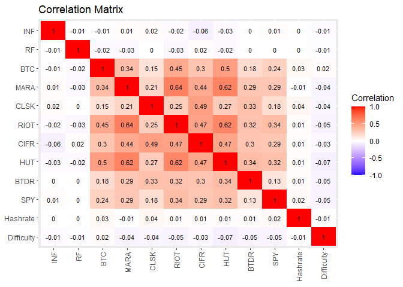

Bitcoin Mining Stock Analysis
================
Last updated: 2025-04-03

## Preliminary Work: Install/Load Packages

To try and ensure that this R Notebook will run successfully, we’ll use
the [renv
package](https://cran.r-project.org/web/packages/renv/index.html) to
create a project-specific library of packages. This will allow us to
install the packages that we need for this project without affecting any
other projects that we may be working on. Additionally, the project
library will track the specific versions of the dependency packages so
that any updates to those packages will not break this project.

The code chunk below will first install the renv package if it is not
already installed. Then we will load the package. Next, we’ll use the
`restore()` function to install any packages listed in the renv.lock
file. Once these packages are installed, we can load them into the R
session using the `library()` commands. Below the code chunk, we’ll list
out the packages that will be used in the project demo. And if you run
into any trouble using renv, then you can use the second code chunk
below and that should be an even more reliable approach to install the
required packages.

``` r
# Install renv package if not already installed
if(!"renv" %in% installed.packages()[,"Package"]) install.packages("renv")
# Load renv package
library(renv)
```

    ## Warning: package 'renv' was built under R version 4.4.3

``` r
# Use restore() to install any packages listed in the renv.lock file
renv::restore(clean=TRUE, lockfile="../renv.lock")
# Load in the packages
library(quantmod)
```

    ## Warning: package 'zoo' was built under R version 4.4.3

``` r
library(tidyverse)
library(reshape2)
library(tseries)
```

    ## Warning: package 'tseries' was built under R version 4.4.3

``` r
library(corrplot)
library(jsonlite)
```

    ## Warning: package 'jsonlite' was built under R version 4.4.3

``` r
library(stargazer)
```

- The [quantmod package](https://cran.r-project.org/package=quantmod)
  contains tools for importing and analyzing financial data.
- The [tidyverse package](https://www.tidyverse.org/) contains a suite
  of packages for data manipulation and visualization.
- The [reshape2 package](https://cran.r-project.org/package=reshape2)
  contains a suite of packages for data manipulation and visualization.
- The [tseries package](https://cran.r-project.org/package=tseries)
  contains additional time series analysis functions that we will
  explore.
- The [corrplot package](https://cran.r-project.org/package=corrplot)
  lets us create correlation plots.
- The [jsonlite package](https://cran.r-project.org/package=jsonlite)
  lets us more easily import JSON data.
- The [stargazer package](https://cran.r-project.org/package=stargazer)
  is used to generate formally typeset tables of regression results.
- The [rmarkdown package](https://cran.r-project.org/package=rmarkdown)
  is used to generate this R Notebook.

Since the rmarkdown functionality is built into RStudio, this last one
is automatically loaded when you open RStudio. So no need to use the
`library()` function for it. Another observation to make about the code
chunk above is that it is labeled as `setup`, which is a special name,
which the R Notebook will recognize and automatically run prior to
running any other code chunk. This is useful for loading in packages and
setting up other global options that will be used throughout the
notebook.

Then if you wish to try and update the versions of the various R
packages in the lock file, you can use the `renv::update()` function to
update the packages in the project library. However, it is possible that
these updates could break the code in this notebook. If so, you may need
to adapt the code to work with the updated packages.

My recommendation is to first run through the code using the versions of
the packages in the lock file. Then if you want to try and update the
packages, you can do so and then run through the code again to see if it
still works. If not, you can always revert back to the lock file
versions using the `renv::restore()` function.

If you update the packages and get everything working successfully, then
you can update the lock file using the `renv::snapshot()` function. This
will update the lock file with the versions of the packages that are
currently installed in the project library. Then you can commit the
updated lock file to the repository so that others can use the updated
versions of the packages.

### Alternative Package Installation Code

If you run into any trouble using renv in the code chunk above, then you
can use the code chunk below to install the required packages for this
analysis. This method will first check if you have already installed the
packages. If any are missing, it will then install them. Then it will
load the packages into the R session. A potential flaw in this approach
compared to using renv is that it will simply install the latest
versions of the packages, which could potentially break some of the code
in this notebook if any of the updates aren’t backwards compatible.

As long as you have downloaded the entire project repository, the renv
chunk above will likely be managing the packages. Thus, the `eval=FALSE`
option is used to prevent this chunk from running unless manually
executed. So if you only downloaded this one Rmd file, this code chunk
should take care of installing the packages for you.

``` r
# Create list of packages needed for this exercise
list.of.packages = c("quantmod","tidyverse","reshape2","tseries","corrplot","jsonlite","stargazer","rmarkdown")
# Check if any have not yet been installed
new.packages = list.of.packages[!(list.of.packages %in% installed.packages()[,"Package"])]
# If any need to be installed, install them
if(length(new.packages)) install.packages(new.packages)
# Load in the packages
library(quantmod)
library(tidyverse)
library(reshape2)
library(tseries)
library(corrplot)
library(jsonlite)
library(stargazer)
```

## Data Import and Cleaning

First, let’s use the `getSymbols()` function from the quantmod package
to import the price data for several assets relevant to our analysis. In
addition to the five mining stocks, we will also import the price data
for Bitcoin and SPY to use as factors in explaining mining stock
performance. Then we’ll import data for inflation rates and treasury
yields to compute real returns and risk premiums.

### Stock and Crypto Data

The `getSymbols()` function will automatically create an xts object for
each asset with the OHLC (open, high, low, close) price series. The
`src` argument specifies the source of the data, which in this case is
Yahoo Finance. The `from` and `to` arguments specify the date range of
the data to be imported. Although MARA stock goes back to mid-2012, the
price series for BTC only goes back to late 2014. So we will pull all
the daily stock data beginning in October 2014. For the other mining
stocks, their series will begin when they first became publicly traded.

``` r
startdate = "2014-10-01"
tickers = c("BTC-USD",
            "MARA",
            "CLSK",
            "RIOT",
            "CIFR",
            "HUT",
            "BTDR",
            "SPY")
getSymbols(tickers,
           src="yahoo",
           from=startdate,
           to=Sys.Date())
```

    ## Warning: BTC-USD contains missing values. Some functions will not work if
    ## objects contain missing values in the middle of the series. Consider using
    ## na.omit(), na.approx(), na.fill(), etc to remove or replace them.

Next, we will convert the daily price data to monthly series using the
`to.monthly()` function from the xts package. Although there could be
some interesting analysis at the daily frequency, the monthly data will
be more useful for analyzing long-term performance and volatility.
Additionally, comparing daily data between bitcoin (which trades 365
days a year) and the stocks (which trade about 250 business days a year)
can be misleading. So the monthly data will be more comparable across
assets.

``` r
BTCdaily = `BTC-USD`
BTCmonth = to.monthly(BTCdaily, name=NULL)
```

    ## Warning in to.period(x, "months", indexAt = indexAt, name = name, ...): missing
    ## values removed from data

``` r
MARAdaily = MARA
MARAmonth = to.monthly(MARAdaily, name=NULL)
CLSKdaily = CLSK
CLSKmonth = to.monthly(CLSKdaily, name=NULL)
RIOTdaily = RIOT
RIOTmonth = to.monthly(RIOTdaily, name=NULL)
CIFRdaily = CIFR
CIFRmonth = to.monthly(CIFRdaily, name=NULL)
HUTdaily = HUT
HUTmonth = to.monthly(HUTdaily, name=NULL)
BTDRdaily = BTDR
BTDRmonth = to.monthly(BTDRdaily, name=NULL)
SPYdaily = SPY
SPYmonth = to.monthly(SPYdaily, name=NULL)
```

Now that we have each of the assets return series saved as daily and
monthly series, let’s compute the annualized returns for each. To do
this, we can assume continuous compounding and use the log returns to
calculate the annualized returns. If you compare the daily data for BTC
and any of the stocks, you’ll notice that BTC trades 365 days a year,
while stock data typically is focused on the roughly 250 trading days
per year. To try and resolve this discrepancy, we’ll just annualize all
of the daily returns using 365 days per year.

``` r
BTCdaily$Return = diff(log(BTCdaily$`BTC-USD.Adjusted`))*365*100
BTCmonth$Return = diff(log(BTCmonth$Adjusted))*12*100
MARAdaily$Return = diff(log(MARAdaily$MARA.Adjusted))*365*100 
MARAmonth$Return = diff(log(MARAmonth$Adjusted))*12*100
CLSKdaily$Return = diff(log(CLSKdaily$CLSK.Adjusted))*365*100
CLSKmonth$Return = diff(log(CLSKmonth$Adjusted))*12*100
RIOTdaily$Return = diff(log(RIOTdaily$RIOT.Adjusted))*365*100
RIOTmonth$Return = diff(log(RIOTmonth$Adjusted))*12*100
CIFRdaily$Return = diff(log(CIFRdaily$CIFR.Adjusted))*365*100
CIFRmonth$Return = diff(log(CIFRmonth$Adjusted))*12*100
HUTdaily$Return = diff(log(HUTdaily$HUT.Adjusted))*365*100
HUTmonth$Return = diff(log(HUTmonth$Adjusted))*12*100
BTDRdaily$Return = diff(log(BTDRdaily$BTDR.Adjusted))*365*100
BTDRmonth$Return = diff(log(BTDRmonth$Adjusted))*12*100
SPYdaily$Return = diff(log(SPYdaily$SPY.Adjusted))*365*100
SPYmonth$Return = diff(log(SPYmonth$Adjusted))*12*100
```

### Economic Data

Now let’s collect some economic from
[FRED](https://fred.stlouisfed.org/) to help with the analysis. We will
import data for the Consumer Price Index (CPI) and the 10-year Treasury
yield. The CPI data will be used to compute monthly inflation rates, and
the 10-year Treasury yields will be used to represent the risk-free rate
of return. Since we’ll be imputing daily inflation rates using linear
interpolation, let’s start the import a month prior to the start of the
stock data.

``` r
fredassets = c("CPIAUCSL","DGS10")
getSymbols(fredassets,
           src="FRED",
           from=as.character(as.Date(startdate) %m-% months(1)), 
           to=Sys.Date())
```

    ## [1] "CPIAUCSL" "DGS10"

The specific CPI series we are using is the [“Consumer Price Index for
All Urban Consumers: All Items”
(CPIAUCSL).](https://fred.stlouisfed.org/series/CPIAUCSL), which is a
common measure for inflation in the U.S. As with the stock price data,
the CPI is an index for prices and tends to increase over time. This
*non-stationarity* of the time series is addressed by converting to
inflation measurements. See
[bitcoin-timeseries-project](https://github.com/tim-dombrowski/bitcoin-timeseries-project)
for more on this concept of time series stationarity.

Also, note that the CPI/inflation series is observed at a monthly
frequency, rather than the daily frequency of the other data. So in the
chunk below, we’ll first compute annualized monthly inflation rates and
then create a daily series that uses linear interpolation to fill in the
missing values. This will allow us to merge the inflation data with the
other daily data, even though the primary analysis and comparisons will
focus on the monthly data.

``` r
# Compute the annualized inflation rate in percentage units
INFmonth = diff(log(CPIAUCSL))*12*100
# Create a daily xts object with the same length as the stock data
INFdaily = xts(order.by=seq(min(index(INFmonth)), length=nrow(BTCdaily), by="day"))
# Merge to monthly inflation observations
INFdaily = merge(INFdaily, INFmonth)
# Impute missing values using linear interpolation
INFdaily = na.approx(INFdaily, na.rm = FALSE)
```

Unlike the stock and CPI variables, which are measured in prices or
index levels, the 10-year treasury yield is already an annualized rate
in percentage units. So while we can use `to.monthly()` to convert the
daily series into a monthly OHLC xts object, it’d be more appropriate to
use the monthly average yield. This is done below using some tools from
the dplyr and lubridate packages.

``` r
# Generate monthly OHLC data for the 10-year treasury yield
DGS10daily = DGS10
DGS10month = to.monthly(DGS10daily, name=NULL)
```

    ## Warning in to.period(x, "months", indexAt = indexAt, name = name, ...): missing
    ## values removed from data

``` r
# Aggregate to monthly frequency and compute means
DGS10dailydf = as.data.frame(DGS10daily)
DGS10dailydf$date = index(DGS10daily)
DGS10monthmean =  mutate(DGS10dailydf, date =floor_date(date,"month")) |> 
  group_by(date) |> summarise(DGS10 = mean(DGS10, na.rm=TRUE))
# Add the means to the monthly xts object
DGS10month$Mean = DGS10monthmean$DGS10
```

### Bitcoin Mining Data

Next, we’ll use [mempool.space](https://mempool.space/) to collect data
on Bitcoin mining difficulty and hashrate. The mining difficulty is a
measure of how difficult it is to find a new block on the Bitcoin
blockchain, while the hashrate is a measure of the total computational
power of the Bitcoin network. Both of these variables can have an impact
on the profitability of Bitcoin mining and the performance of Bitcoin
mining stocks.

#### Hashrate Data

First, specify the API base and endpoint for the hashrate (see the
[mempool.space API Documentation](https://mempool.space/docs/api/rest)
for more details). Then make the API call and read the JSON response
with the `fromJSON()` function from the jsonlite package.

``` r
# Build endpoint url for hashrates
mempoolbase = "https://mempool.space/api/v1/"
hashrateendpt = "mining/hashrate/pools/"
hashrateurl = paste(mempoolbase, hashrateendpt, sep="")
# Make API call and read JSON response
hashrateresponse = fromJSON(hashrateurl)
```

Next, we’ll extract the hashrate and difficulty data from the JSON
response and reformat the dates from Unix time to the R Date format.
Then we’ll convert the daily hashrate data to monthly data by
calculating the average hashrate for each month.

``` r
# Extract hashrate table and difficulty table
hashratedf = hashrateresponse$hashrates
difficultydf = hashrateresponse$difficulty
# Reformat dates from unix time to R date
hashratedf$date = hashratedf$timestamp |> as.POSIXct() |> as.Date()
difficultydf$date = difficultydf$time |> as.POSIXct() |> as.Date()
# Convert daily hashrate data to monthly averages
hashratemonthdf =  mutate(hashratedf, date =floor_date(date,"month")) |> 
  group_by(date) |> summarise(avgHashrate = mean(avgHashrate, na.rm=TRUE))
```

Now that we have the hashrate data at both daily and monthly
frequencies, let’s focus a bit on the units. If we plot the hashrate
data, we’ll see that the units are in hashes per second. This quickly
grows to a very large number, so it’s common to see the hashrate
expressed in terms of terahashes per second (TH/s), petahashes per
second (PH/s), or exahashes per second (EH/s). See the values in the
code chunk below for the scale of an exahash. *The warning generated by
the log hashrate chart results from a few 0 observations in the data for
the some of the earliest days in the Bitcoin network.*

``` r
# Plot the hashrate data (daily in gray, monthly in black)
ggplot() +
  geom_line(aes(x=hashratedf$date, y=hashratedf$avgHashrate/1000000000000000000), color="darkgray") +
  geom_line(aes(x=hashratemonthdf$date, y=hashratemonthdf$avgHashrate/1000000000000000000), color="black") +
  labs(title="Bitcoin Network Hashrate (1 EH = 1,000,000,000,000,000,000 hashes)",
       x="Date",
       y="Hashrate (EH/s)")
```

<!-- -->

``` r
# Log chart for the hashrate data (daily in gray, monthly in black)
ggplot() +
  geom_line(aes(x=hashratedf$date, y=hashratedf$avgHashrate), color="darkgray") +
  geom_line(aes(x=hashratemonthdf$date, y=hashratemonthdf$avgHashrate), color="black") +
  scale_y_continuous(transform='log10') +
  labs(title="Bitcoin Network Hashrate, log scale",
       x="Date",
       y="Hashrate (hashes/s)")
```

    ## Warning in scale_y_continuous(transform = "log10"): log-10 transformation
    ## introduced infinite values.

<!-- -->

Since this data looks non-stationary, let’s compute a differenced
series. As with the stock series and economic data, we’ll compute an
annualized growth rate. Then we can validate this transformation by
using the Augmented Dickey-Fuller test.

``` r
# Calculate daily hashrate growth and annualize it
hashratedf$annHashrateGrowth = c(NA, diff(log(hashratedf$avgHashrate))*365*100)
# Calculate monthly hashrate growth and annualize it
hashratemonthdf$annHashrateGrowth = c(NA, diff(log(hashratemonthdf$avgHashrate))*12*100)
```

To demonstrate non-stationarity of the hashrate series and stationarity
of the growth rates, the Augmented Dickey-Fuller test will be used. The
null hypothesis of the ADF test is that the series has a unit root,
which implies that the series is non-stationary. If the p-value of the
test is less than 0.05, then we can reject the null hypothesis and
conclude that the series is stationary. Note the removal of the first 8
observations from the daily test, as the hashrate data in the first few
days has some 0’s, which produce some Inf and -Inf growth rates.

``` r
adf.test(hashratedf$avgHashrate[-c(1:8)])
```

    ## Warning in adf.test(hashratedf$avgHashrate[-c(1:8)]): p-value greater than
    ## printed p-value

    ## 
    ##  Augmented Dickey-Fuller Test
    ## 
    ## data:  hashratedf$avgHashrate[-c(1:8)]
    ## Dickey-Fuller = 3.2609, Lag order = 18, p-value = 0.99
    ## alternative hypothesis: stationary

``` r
adf.test(hashratedf$annHashrateGrowth[-c(1:8)])
```

    ## Warning in adf.test(hashratedf$annHashrateGrowth[-c(1:8)]): p-value smaller
    ## than printed p-value

    ## 
    ##  Augmented Dickey-Fuller Test
    ## 
    ## data:  hashratedf$annHashrateGrowth[-c(1:8)]
    ## Dickey-Fuller = -20.16, Lag order = 18, p-value = 0.01
    ## alternative hypothesis: stationary

``` r
adf.test(hashratemonthdf$avgHashrate[-1])
```

    ## Warning in adf.test(hashratemonthdf$avgHashrate[-1]): p-value greater than
    ## printed p-value

    ## 
    ##  Augmented Dickey-Fuller Test
    ## 
    ## data:  hashratemonthdf$avgHashrate[-1]
    ## Dickey-Fuller = 4.8329, Lag order = 5, p-value = 0.99
    ## alternative hypothesis: stationary

``` r
adf.test(hashratemonthdf$annHashrateGrowth[-1])
```

    ## Warning in adf.test(hashratemonthdf$annHashrateGrowth[-1]): p-value smaller
    ## than printed p-value

    ## 
    ##  Augmented Dickey-Fuller Test
    ## 
    ## data:  hashratemonthdf$annHashrateGrowth[-1]
    ## Dickey-Fuller = -4.2395, Lag order = 5, p-value = 0.01
    ## alternative hypothesis: stationary

After cleaning the hashrate data, let’s reformat to an xts object and
remove any observations prior to the start of the price series.

``` r
# Preview first 10 rows of hash rate data
head(hashratedf, 10)
```

    ##     timestamp avgHashrate       date annHashrateGrowth
    ## 1  1231006505    9273.324 2009-01-03                NA
    ## 2  1231027200       0.000 2009-01-04              -Inf
    ## 3  1231113600       0.000 2009-01-05               NaN
    ## 4  1231200000       0.000 2009-01-06               NaN
    ## 5  1231286400       0.000 2009-01-07               NaN
    ## 6  1231372800       0.000 2009-01-08               NaN
    ## 7  1231459200       0.000 2009-01-09               NaN
    ## 8  1231545600  128186.976 2009-01-10               Inf
    ## 9  1231632000 1676963.272 2009-01-11          93850.62
    ## 10 1231718400 4679507.181 2009-01-12          37456.60

``` r
# Convert data frame to xts object
hashratexts = xts(hashratedf, order.by=hashratedf$date)
# Remove observations prior to startdate
hashratexts = hashratexts[paste0(as.character(startdate), "/")]
# Convert monthly data to xts object
hashratemonthxts = xts(hashratemonthdf, order.by=hashratemonthdf$date)
# Remove observations prior to startdate
hashratemonthxts = hashratemonthxts[paste0(as.character(startdate), "/")]
```

#### Difficulty Data

In addition to the hashrate data, the response from the mempool.space
API includes the mining difficulty, which is a measure of how difficult
it is to find a new block on the Bitcoin blockchain. The difficulty is
adjusted every 2,016 blocks to ensure that the average time between
blocks is approximately 10 minutes. The difficulty is a key factor in
determining the profitability of Bitcoin mining, as it affects the
amount of computational power required to mine new blocks.

Since the difficulty adjustment frequency is measured in blocks, this
time series is much less uniform than the daily and monthly data for the
other variables. To make the data more uniform, we’ll fill the
intermediate days with the last observed value. This is known as the
last-observation-carried-forward method (`na.locf()`). Then we’ll
convert the daily difficulty data to monthly data by taking the average
difficulty for each month and doing much of the same processing as was
done for the hashrate data. See the comments in the code chunk for more
details.

``` r
# Convert mining difficulty series to xts object
difficultyxts = xts(difficultydf, order.by=difficultydf$date)
# Create a daily xts object with the same length as the hashrate data
difficultydailyxts = xts(order.by=seq(min(difficultydf$date), length=length(hashratedf$date), by="day"))
# Merge the daily difficulty data with the daily hashrate data
difficultydailyxts = merge(difficultydailyxts, difficultyxts)
```

    ## Warning in merge.xts(difficultydailyxts, difficultyxts): NAs introduced by
    ## coercion

``` r
# Impute missing values using last-observation-carried-forward method
difficultydailyxts = na.locf(difficultydailyxts)
# Fix the date column
#difficultydailyxts = subset(difficultydailyxts, select=-date) 
difficultydailydf = data.frame(difficultydailyxts)
difficultydailydf$date = index(difficultydailyxts)
# Convert daily hashrate data to monthly averages
difficultymonthdf =  mutate(difficultydailydf, date=floor_date(date,"month")) |> 
  group_by(date) |> summarise(avgDifficulty=mean(difficulty, na.rm=TRUE))
# Plot the difficulty data (daily in gray, monthly in black)
ggplot() +
  geom_line(aes(x=difficultydailydf$date, y=difficultydailydf$difficulty), color="darkgray") +
  geom_line(aes(x=difficultymonthdf$date, y=difficultymonthdf$avgDifficulty), color="black") +
  labs(title="Bitcoin Network Difficulty",
       x="Date",
       y="Difficulty")
```

<!-- -->

``` r
# Log chart for the hashrate data (daily in gray, monthly in black)
ggplot() +
  geom_line(aes(x=difficultydailydf$date, y=difficultydailydf$difficulty), color="darkgray") +
  geom_line(aes(x=difficultymonthdf$date, y=difficultymonthdf$avgDifficulty), color="black") +
  scale_y_continuous(transform='log10') +
  labs(title="Bitcoin Network Difficulty, log scale",
       x="Date",
       y="Difficulty")
```

<!-- -->

``` r
# Compute difficulty growth rates
difficultydailydf$annDifficultyGrowth = c(NA, diff(log(difficultydailydf$difficulty))*365*100)
difficultymonthdf$annDifficultyGrowth = c(NA, diff(log(difficultymonthdf$avgDifficulty))*12*100)
# Estimate ADF tests
adf.test(difficultydailydf$difficulty[-c(1:8)])
```

    ## Warning in adf.test(difficultydailydf$difficulty[-c(1:8)]): p-value greater
    ## than printed p-value

    ## 
    ##  Augmented Dickey-Fuller Test
    ## 
    ## data:  difficultydailydf$difficulty[-c(1:8)]
    ## Dickey-Fuller = 4.2726, Lag order = 18, p-value = 0.99
    ## alternative hypothesis: stationary

``` r
adf.test(difficultydailydf$annDifficultyGrowth[-c(1:8)])
```

    ## Warning in adf.test(difficultydailydf$annDifficultyGrowth[-c(1:8)]): p-value
    ## smaller than printed p-value

    ## 
    ##  Augmented Dickey-Fuller Test
    ## 
    ## data:  difficultydailydf$annDifficultyGrowth[-c(1:8)]
    ## Dickey-Fuller = -13.341, Lag order = 18, p-value = 0.01
    ## alternative hypothesis: stationary

``` r
adf.test(difficultymonthdf$avgDifficulty[-1])
```

    ## Warning in adf.test(difficultymonthdf$avgDifficulty[-1]): p-value greater than
    ## printed p-value

    ## 
    ##  Augmented Dickey-Fuller Test
    ## 
    ## data:  difficultymonthdf$avgDifficulty[-1]
    ## Dickey-Fuller = 4.3443, Lag order = 5, p-value = 0.99
    ## alternative hypothesis: stationary

``` r
adf.test(difficultymonthdf$annDifficultyGrowth[-1])
```

    ## 
    ##  Augmented Dickey-Fuller Test
    ## 
    ## data:  difficultymonthdf$annDifficultyGrowth[-1]
    ## Dickey-Fuller = -3.8703, Lag order = 5, p-value = 0.01683
    ## alternative hypothesis: stationary

``` r
# Convert monthly data to xts object
difficultymonthxts = xts(difficultymonthdf, order.by=difficultymonthdf$date)
# Add annDifficultyGrowth to daily xts object
difficultydailyxts$annDifficultyGrowth = xts(difficultydailydf$annDifficultyGrowth, order.by=index(difficultydailyxts))
# Remove observations prior to startdate
difficultydailyxts = difficultydailyxts[paste(as.character(startdate), "/", sep="")]
difficultymonthxts = difficultymonthxts[paste(as.character(startdate), "/", sep="")]
```

### Merge Final Dataset

Now that we have the annualized daily returns and annualized monthly
returns, let’s consolidate those values into a single data frame for
each frequency. This will make it easier to analyze the data and create
visualizations.

``` r
# Merge the daily returns into a single data frame
dailyreturns = merge(INFdaily$CPIAUCSL,
                     DGS10daily$DGS10,
                     BTCdaily$Return,
                     MARAdaily$Return,
                     CLSKdaily$Return,
                     RIOTdaily$Return,
                     CIFRdaily$Return,
                     HUTdaily$Return,
                     BTDRdaily$Return,
                     SPYdaily$Return,
                     hashratexts$annHashrateGrowth,
                     difficultydailyxts$annDifficultyGrowth)
colnames(dailyreturns) = c("INF","RF","BTC","MARA","CLSK","RIOT","CIFR","HUT","BTDR","SPY","Hashrate","Difficulty")
# Merge the monthly returns into a single data frame
monthlyreturns = merge(INFmonth$CPIAUCSL,
                       DGS10month$Mean,
                       BTCmonth$Return,
                       MARAmonth$Return,
                       CLSKmonth$Return,
                       RIOTmonth$Return,
                       CIFRmonth$Return,
                       HUTmonth$Return,
                       BTDRmonth$Return,
                       SPYmonth$Return,
                       hashratemonthxts$annHashrateGrowth,
                       difficultymonthxts$annDifficultyGrowth)
colnames(monthlyreturns) = c("INF","RF","BTC","MARA","CLSK","RIOT","CIFR","HUT","BTDR","SPY","Hashrate","Difficulty")
# Drop data prior to earliest inflation observation
dailyreturns = dailyreturns["2014-11-01/",]
monthlyreturns = monthlyreturns["2014-11-01/",]
# Trim any observations since the last inflation reading (typically 60-90 days)
ntrim = sum(is.na(tail(dailyreturns$INF,100)))
daily_nominal = dailyreturns[1:(nrow(dailyreturns)-ntrim),]
# Same for monthly series (typically 1-2 observations)
ntrim = sum(is.na(tail(monthlyreturns$INF)))
monthly_nominal = monthlyreturns[1:(nrow(monthlyreturns)-ntrim),]
```

## Data Analysis

### Real Returns

To compute the real returns for each asset, we will subtract the
inflation rate from the nominal returns. This will allow us to analyze
the performance of each asset after adjusting for inflation. We will
compute the real returns for both the daily and monthly return series.

``` r
infadjust = function(nominal, inf) {
  return((nominal-inf)/(1+(inf/100)))
}
# Compute real returns for daily series
daily_real = daily_nominal[,-1] # drop INF column since it is used here
daily_real$RF = infadjust(daily_nominal$RF, daily_nominal$INF)
daily_real$BTC = infadjust(daily_nominal$BTC, daily_nominal$INF)
daily_real$MARA = infadjust(daily_nominal$MARA, daily_nominal$INF)
daily_real$CLSK = infadjust(daily_nominal$CLSK, daily_nominal$INF)
daily_real$RIOT = infadjust(daily_nominal$RIOT, daily_nominal$INF)
daily_real$CIFR = infadjust(daily_nominal$CIFR, daily_nominal$INF)
daily_real$HUT = infadjust(daily_nominal$HUT, daily_nominal$INF)
daily_real$BTDR = infadjust(daily_nominal$BTDR, daily_nominal$INF)
daily_real$SPY = infadjust(daily_nominal$SPY, daily_nominal$INF)
# Compute real returns for monthly series
monthly_real = monthly_nominal[,-1] # drop INF column since it is used here
monthly_real$RF = infadjust(monthly_nominal$RF, monthly_nominal$INF)
monthly_real$BTC = infadjust(monthly_nominal$BTC, monthly_nominal$INF)
monthly_real$MARA = infadjust(monthly_nominal$MARA, monthly_nominal$INF)
monthly_real$CLSK = infadjust(monthly_nominal$CLSK, monthly_nominal$INF)
monthly_real$RIOT = infadjust(monthly_nominal$RIOT, monthly_nominal$INF)
monthly_real$CIFR = infadjust(monthly_nominal$CIFR, monthly_nominal$INF)
monthly_real$HUT = infadjust(monthly_nominal$HUT, monthly_nominal$INF)
monthly_real$BTDR = infadjust(monthly_nominal$BTDR, monthly_nominal$INF)
monthly_real$SPY = infadjust(monthly_nominal$SPY, monthly_nominal$INF)
```

### Excess Returns (Risk Premiums)

To compute the excess returns for each asset, we will subtract the
risk-free rate of return from the real returns. This will allow us to
analyze the performance of each asset after adjusting for inflation and
the risk-free rate. We will compute the excess returns for both the
daily and monthly return series.

``` r
# Compute excess returns for daily series
daily_excess = daily_real[,-1] # drop RF column since it is used here
daily_excess$BTC = daily_real$BTC - daily_real$RF
daily_excess$MARA = daily_real$MARA - daily_real$RF
daily_excess$CLSK = daily_real$CLSK - daily_real$RF
daily_excess$RIOT = daily_real$RIOT - daily_real$RF
daily_excess$CIFR = daily_real$CIFR - daily_real$RF
daily_excess$HUT = daily_real$HUT - daily_real$RF
daily_excess$BTDR = daily_real$BTDR - daily_real$RF
daily_excess$SPY = daily_real$SPY - daily_real$RF
# Compute excess returns for monthly series
monthly_excess = monthly_real[,-1] # drop RF column since it is used here
monthly_excess$BTC = monthly_real$BTC - monthly_real$RF
monthly_excess$MARA = monthly_real$MARA - monthly_real$RF
monthly_excess$CLSK = monthly_real$CLSK - monthly_real$RF
monthly_excess$RIOT = monthly_real$RIOT - monthly_real$RF
monthly_excess$CIFR = monthly_real$CIFR - monthly_real$RF
monthly_excess$HUT = monthly_real$HUT - monthly_real$RF
monthly_excess$BTDR = monthly_real$BTDR - monthly_real$RF
monthly_excess$SPY = monthly_real$SPY - monthly_real$RF
```

### Univariate Statistics

We will start by calculating the average annual returns and standard
deviations for each series. The chunk below focuses on the daily
returns. First, we’ll compute the average annualized nominal returns,
real returns, and excess returns for each asset. Then we’ll compute the
standard deviation of the annual returns for each asset. We’ll do the
same for the monthly returns in the next chunk.

``` r
# Compute the average annualized nominal returns
colMeans(daily_nominal, na.rm=TRUE) |> round(2)
```

    ##        INF         RF        BTC       MARA       CLSK       RIOT       CIFR 
    ##       2.90       2.49      55.50     -24.36     -21.36      26.21     -18.57 
    ##        HUT       BTDR        SPY   Hashrate Difficulty 
    ##       3.94      25.50      18.03      75.12      78.03

``` r
# Compute the average annualized real returns
colMeans(daily_real, na.rm=TRUE) |> round(2)
```

    ##         RF        BTC       MARA       CLSK       RIOT       CIFR        HUT 
    ##      -0.31      51.45     -27.84     -25.92      23.51     -18.03       2.26 
    ##       BTDR        SPY   Hashrate Difficulty 
    ##      19.95      14.62      75.12      78.03

``` r
# Compute the average annualized excess returns
colMeans(daily_excess, na.rm=TRUE) |> round(2)
```

    ##        BTC       MARA       CLSK       RIOT       CIFR        HUT       BTDR 
    ##      59.13     -34.50     -35.61      16.17     -12.18      -1.44      13.24 
    ##        SPY   Hashrate Difficulty 
    ##      14.89      75.12      78.03

``` r
# Compute the standard deviation of the annual nominal returns
apply(daily_nominal, 2, sd, na.rm=TRUE) |> round(2)
```

    ##        INF         RF        BTC       MARA       CLSK       RIOT       CIFR 
    ##       3.19       1.06    1327.03    2958.30    3456.09    2582.94    2583.82 
    ##        HUT       BTDR        SPY   Hashrate Difficulty 
    ##    2613.21    2191.61     403.89    4387.84     674.90

``` r
# Compute the standard deviation of the annual real returns
apply(daily_real, 2, sd, na.rm=TRUE) |> round(2)
```

    ##         RF        BTC       MARA       CLSK       RIOT       CIFR        HUT 
    ##       3.24    1298.92    2875.98    3376.44    2502.21    2460.59    2539.59 
    ##       BTDR        SPY   Hashrate Difficulty 
    ##    2124.48     403.50    4387.84     674.90

``` r
# Compute the standard deviation of the annual excess returns
apply(daily_excess, 2, sd, na.rm=TRUE) |> round(2)
```

    ##        BTC       MARA       CLSK       RIOT       CIFR        HUT       BTDR 
    ##    1411.86    2876.56    3376.53    2500.56    2448.49    2538.30    2108.26 
    ##        SPY   Hashrate Difficulty 
    ##     404.39    4387.84     674.90

Now at the monthly frequency:

``` r
# Compute the average annualized nominal returns
colMeans(monthly_nominal, na.rm=TRUE) |> round(2)
```

    ##        INF         RF        BTC       MARA       CLSK       RIOT       CIFR 
    ##       2.88       2.51      53.41     -19.31     -17.90      15.13     -20.34 
    ##        HUT       BTDR        SPY   Hashrate Difficulty 
    ##       2.08       6.62      12.20      77.73      78.02

``` r
# Compute the average annualized real returns
colMeans(monthly_real, na.rm=TRUE) |> round(2)
```

    ##         RF        BTC       MARA       CLSK       RIOT       CIFR        HUT 
    ##      -0.25      49.55     -22.07     -21.19      12.89     -20.71       0.68 
    ##       BTDR        SPY   Hashrate Difficulty 
    ##       2.22       9.14      77.73      78.02

``` r
# Compute the average annualized excess returns
colMeans(monthly_excess, na.rm=TRUE) |> round(2)
```

    ##        BTC       MARA       CLSK       RIOT       CIFR        HUT       BTDR 
    ##      49.80     -21.82     -20.59      13.50     -19.26       1.42       3.09 
    ##        SPY   Hashrate Difficulty 
    ##       9.39      77.73      78.02

``` r
# Compute the standard deviation of the annual nominal returns
apply(monthly_nominal, 2, sd, na.rm=TRUE) |> round(2)
```

    ##        INF         RF        BTC       MARA       CLSK       RIOT       CIFR 
    ##       3.47       1.07     241.85     435.40     425.73     391.58     338.69 
    ##        HUT       BTDR        SPY   Hashrate Difficulty 
    ##     407.65     372.04      52.37     103.11     102.03

``` r
# Compute the standard deviation of the annual real returns
apply(monthly_real, 2, sd, na.rm=TRUE) |> round(2)
```

    ##         RF        BTC       MARA       CLSK       RIOT       CIFR        HUT 
    ##       3.47     235.98     422.37     410.93     378.46     322.92     393.70 
    ##       BTDR        SPY   Hashrate Difficulty 
    ##     363.06      51.62     103.11     102.03

``` r
# Compute the standard deviation of the annual excess returns
apply(monthly_excess, 2, sd, na.rm=TRUE) |> round(2)
```

    ##        BTC       MARA       CLSK       RIOT       CIFR        HUT       BTDR 
    ##     235.96     422.65     411.12     378.27     321.83     393.33     363.05 
    ##        SPY   Hashrate Difficulty 
    ##      51.60     103.11     102.03

However, an important note to make about the results above is that only
BTC, MARA, and SPY have data going back to 2014. So the other mining
stocks each have shorter time frames. Thus, we should be cautious to
draw any comparative conclusions from the stats above.

### Subset to Final Datasets

To create a more comparable basis for analysis, let’s create a subset of
the monthly series that only includes observations where all assets have
data.

``` r
# Subset down to complete.cases
monthly_nominal_final = monthly_nominal[complete.cases(monthly_nominal),]
monthly_real_final = monthly_real[complete.cases(monthly_real),]
monthly_excess_final = monthly_excess[complete.cases(monthly_excess),]
```

Now let’s re-run the univariate statistics for the final subset of
monthly data.

``` r
# Compute the average annualized nominal returns
colMeans(monthly_nominal_final, na.rm=TRUE) |> round(2)
```

    ##        INF         RF        BTC       MARA       CLSK       RIOT       CIFR 
    ##       4.52       3.48      19.72     -19.13     -14.64     -35.36     -24.79 
    ##        HUT       BTDR        SPY   Hashrate Difficulty 
    ##     -13.18       6.62       9.89      58.31      57.13

``` r
# Compute the average annualized real returns
colMeans(monthly_real_final, na.rm=TRUE) |> round(2)
```

    ##         RF        BTC       MARA       CLSK       RIOT       CIFR        HUT 
    ##      -0.87      16.18     -19.57     -17.48     -35.34     -24.17     -13.57 
    ##       BTDR        SPY   Hashrate Difficulty 
    ##       2.22       5.59      58.31      57.13

``` r
# Compute the average annualized excess returns
colMeans(monthly_excess_final, na.rm=TRUE) |> round(2)
```

    ##        BTC       MARA       CLSK       RIOT       CIFR        HUT       BTDR 
    ##      17.05     -18.70     -16.61     -34.48     -23.30     -12.70       3.09 
    ##        SPY   Hashrate Difficulty 
    ##       6.46      58.31      57.13

``` r
# Compute the standard deviation of the annual nominal returns
apply(monthly_nominal_final, 2, sd, na.rm=TRUE) |> round(2)
```

    ##        INF         RF        BTC       MARA       CLSK       RIOT       CIFR 
    ##       3.55       1.02     206.56     456.06     387.64     371.16     372.69 
    ##        HUT       BTDR        SPY   Hashrate Difficulty 
    ##     423.12     372.04      58.06      58.59      54.70

``` r
# Compute the standard deviation of the annual real returns
apply(monthly_real_final, 2, sd, na.rm=TRUE) |> round(2)
```

    ##         RF        BTC       MARA       CLSK       RIOT       CIFR        HUT 
    ##       3.84     194.39     437.31     367.56     354.29     355.38     403.91 
    ##       BTDR        SPY   Hashrate Difficulty 
    ##     363.06      56.08      58.59      54.70

``` r
# Compute the standard deviation of the annual excess returns
apply(monthly_excess_final, 2, sd, na.rm=TRUE) |> round(2)
```

    ##        BTC       MARA       CLSK       RIOT       CIFR        HUT       BTDR 
    ##     193.46     436.63     367.25     353.42     354.16     403.12     363.05 
    ##        SPY   Hashrate Difficulty 
    ##      55.25      58.59      54.70

Since we have the excess returns, we can quite easily calculate Sharpe
ratios for each asset to compare risk-adjusted returns. The Sharpe ratio
is calculated as the average excess return divided by the standard
deviation of the excess returns. The higher the Sharpe ratio, the better
the risk-adjusted return.

``` r
# Compute the Sharpe ratios for the monthly excess returns
sharpe = colMeans(monthly_excess_final, na.rm=TRUE)/apply(monthly_excess_final, 2, sd, na.rm=TRUE)
sharpe |> round(4)
```

    ##        BTC       MARA       CLSK       RIOT       CIFR        HUT       BTDR 
    ##     0.0881    -0.0428    -0.0452    -0.0975    -0.0658    -0.0315     0.0085 
    ##        SPY   Hashrate Difficulty 
    ##     0.1169     0.9952     1.0444

### Multivariate Statistics

Now let’s explore the relationships between the variables in our cleaned
dataset. For each frequency, we’ll generate a correlation matrix and a
correlation plot to visualize the relationships between the assets.

#### Correlations

Since the transformations from nominal to real and excess returns are
linear, the correlations remain the same. So for the daily data, we’ll
compute the correlation matrix for the nominal returns and then create a
correlation plot. *Note the use of the `use="pairwise.complete"`
argument in the `cor()` function to handle missing values in the data,
and the use of the `|>` operator to round the answers to two decimal
places.*

``` r
# Compute the correlation matrix for the daily returns
dailycordata = cor(daily_nominal, use="pairwise.complete")
dailycordata |> round(2)
```

    ##              INF    RF   BTC  MARA  CLSK  RIOT  CIFR   HUT  BTDR   SPY Hashrate
    ## INF         1.00 -0.01 -0.01  0.01  0.02 -0.02 -0.06 -0.03  0.00  0.01     0.00
    ## RF         -0.01  1.00 -0.02 -0.03  0.00 -0.03  0.02 -0.02  0.00  0.00     0.00
    ## BTC        -0.01 -0.02  1.00  0.34  0.15  0.45  0.30  0.50  0.18  0.24     0.03
    ## MARA        0.01 -0.03  0.34  1.00  0.21  0.64  0.44  0.62  0.29  0.29    -0.01
    ## CLSK        0.02  0.00  0.15  0.21  1.00  0.25  0.49  0.27  0.33  0.18     0.04
    ## RIOT       -0.02 -0.03  0.45  0.64  0.25  1.00  0.47  0.62  0.32  0.34     0.01
    ## CIFR       -0.06  0.02  0.30  0.44  0.49  0.47  1.00  0.47  0.30  0.29     0.01
    ## HUT        -0.03 -0.02  0.50  0.62  0.27  0.62  0.47  1.00  0.34  0.32     0.01
    ## BTDR        0.00  0.00  0.18  0.29  0.33  0.32  0.30  0.34  1.00  0.13     0.01
    ## SPY         0.01  0.00  0.24  0.29  0.18  0.34  0.29  0.32  0.13  1.00     0.02
    ## Hashrate    0.00  0.00  0.03 -0.01  0.04  0.01  0.01  0.01  0.01  0.02     1.00
    ## Difficulty -0.01 -0.01  0.02 -0.04 -0.04 -0.05 -0.03 -0.07 -0.05 -0.05    -0.01
    ##            Difficulty
    ## INF             -0.01
    ## RF              -0.01
    ## BTC              0.02
    ## MARA            -0.04
    ## CLSK            -0.04
    ## RIOT            -0.05
    ## CIFR            -0.03
    ## HUT             -0.07
    ## BTDR            -0.05
    ## SPY             -0.05
    ## Hashrate        -0.01
    ## Difficulty       1.00

``` r
dailycormelt = melt(dailycordata)
dailycormelt$Var2 = factor(dailycormelt$Var2, levels=rev(levels(factor(dailycormelt$Var2))))
dailycorplot = ggplot(data=dailycormelt, aes(x=Var1, y=Var2, fill=value)) + 
  geom_tile() +
  geom_text(aes(label = round(value, 2)), color="black", size=3) +
  scale_fill_gradient2(low="blue", mid="white", high="red", 
                       midpoint=0, limit=c(-1, 1), 
                       space="Lab", name="Correlation") +
  theme(axis.text.x=element_text(angle=90, vjust=0.5, hjust=1),
        axis.title.x = element_blank(),
        axis.title.y = element_blank())+
  ggtitle("Correlation Matrix")
# Display plot
print(dailycorplot)
```

<!-- -->

``` r
# Save figure as PDF
ggsave("Figures/dailycorplot.pdf", dailycorplot, height=6, width=7)
```

Now for the monthly data, we’ll start with the full dataset using the
`pairwise.complete` option for handling the missing values.

``` r
# Compute the correlation matrix for the full monthly returns
monthlycordata = cor(monthly_nominal, use="pairwise.complete")
monthlycordata |> round(2)
```

    ##              INF    RF   BTC  MARA  CLSK  RIOT  CIFR   HUT  BTDR   SPY Hashrate
    ## INF         1.00  0.04 -0.05  0.03  0.05 -0.11 -0.32 -0.16 -0.01  0.02    -0.12
    ## RF          0.04  1.00 -0.08 -0.12 -0.02 -0.16  0.11 -0.10 -0.03 -0.03    -0.03
    ## BTC        -0.05 -0.08  1.00  0.51  0.35  0.62  0.53  0.72  0.08  0.38     0.14
    ## MARA        0.03 -0.12  0.51  1.00  0.52  0.73  0.57  0.72  0.24  0.51    -0.01
    ## CLSK        0.05 -0.02  0.35  0.52  1.00  0.46  0.54  0.41  0.12  0.47     0.06
    ## RIOT       -0.11 -0.16  0.62  0.73  0.46  1.00  0.58  0.68  0.08  0.50    -0.01
    ## CIFR       -0.32  0.11  0.53  0.57  0.54  0.58  1.00  0.66  0.14  0.38     0.06
    ## HUT        -0.16 -0.10  0.72  0.72  0.41  0.68  0.66  1.00  0.31  0.42     0.14
    ## BTDR       -0.01 -0.03  0.08  0.24  0.12  0.08  0.14  0.31  1.00  0.26    -0.11
    ## SPY         0.02 -0.03  0.38  0.51  0.47  0.50  0.38  0.42  0.26  1.00     0.03
    ## Hashrate   -0.12 -0.03  0.14 -0.01  0.06 -0.01  0.06  0.14 -0.11  0.03     1.00
    ## Difficulty -0.09 -0.02  0.10  0.00 -0.03 -0.06 -0.05  0.08  0.01 -0.02     0.85
    ##            Difficulty
    ## INF             -0.09
    ## RF              -0.02
    ## BTC              0.10
    ## MARA             0.00
    ## CLSK            -0.03
    ## RIOT            -0.06
    ## CIFR            -0.05
    ## HUT              0.08
    ## BTDR             0.01
    ## SPY             -0.02
    ## Hashrate         0.85
    ## Difficulty       1.00

``` r
monthlycormelt = melt(monthlycordata)
monthlycormelt$Var2 = factor(monthlycormelt$Var2, levels=rev(levels(factor(monthlycormelt$Var2))))
monthlycorplot = ggplot(data=monthlycormelt, aes(x=Var1, y=Var2, fill=value)) + 
  geom_tile() +
  geom_text(aes(label = round(value, 2)), color="black", size=3) +
  scale_fill_gradient2(low="blue", mid="white", high="red", 
                       midpoint=0, limit=c(-1, 1), 
                       space="Lab", name="Correlation") +
  theme(axis.text.x=element_text(angle=90, vjust=0.5, hjust=1),
        axis.title.x = element_blank(),
        axis.title.y = element_blank())+
  ggtitle("Correlation Matrix")
# Display plot
print(monthlycorplot)
```

<!-- -->

``` r
# Save figure as PDF
ggsave("Figures/monthlycorplot.pdf", monthlycorplot, height=6, width=7)
```

Then we’ll create a correlation matrix and plot for the subset with no
missing values.

``` r
# Compute the correlation matrix for the full monthly returns
finalcordata = cor(monthly_nominal_final, use="pairwise.complete")
finalcordata |> round(2)
```

    ##              INF    RF   BTC  MARA  CLSK  RIOT  CIFR   HUT  BTDR   SPY Hashrate
    ## INF         1.00 -0.53 -0.25 -0.21 -0.06 -0.24 -0.33 -0.25 -0.01 -0.19     0.15
    ## RF         -0.53  1.00  0.16  0.01  0.10  0.10  0.18 -0.01 -0.03  0.13    -0.33
    ## BTC        -0.25  0.16  1.00  0.78  0.74  0.71  0.63  0.75  0.08  0.57     0.32
    ## MARA       -0.21  0.01  0.78  1.00  0.77  0.85  0.65  0.85  0.24  0.67     0.23
    ## CLSK       -0.06  0.10  0.74  0.77  1.00  0.74  0.60  0.68  0.12  0.52     0.20
    ## RIOT       -0.24  0.10  0.71  0.85  0.74  1.00  0.71  0.72  0.08  0.55     0.20
    ## CIFR       -0.33  0.18  0.63  0.65  0.60  0.71  1.00  0.73  0.14  0.40     0.11
    ## HUT        -0.25 -0.01  0.75  0.85  0.68  0.72  0.73  1.00  0.31  0.54     0.27
    ## BTDR       -0.01 -0.03  0.08  0.24  0.12  0.08  0.14  0.31  1.00  0.26    -0.11
    ## SPY        -0.19  0.13  0.57  0.67  0.52  0.55  0.40  0.54  0.26  1.00     0.04
    ## Hashrate    0.15 -0.33  0.32  0.23  0.20  0.20  0.11  0.27 -0.11  0.04     1.00
    ## Difficulty  0.22 -0.27  0.21  0.10  0.09  0.04 -0.07  0.05  0.01  0.04     0.68
    ##            Difficulty
    ## INF              0.22
    ## RF              -0.27
    ## BTC              0.21
    ## MARA             0.10
    ## CLSK             0.09
    ## RIOT             0.04
    ## CIFR            -0.07
    ## HUT              0.05
    ## BTDR             0.01
    ## SPY              0.04
    ## Hashrate         0.68
    ## Difficulty       1.00

``` r
finalcormelt = melt(finalcordata)
finalcormelt$Var2 = factor(finalcormelt$Var2, levels=rev(levels(factor(finalcormelt$Var2))))
finalcorplot = ggplot(data=finalcormelt, aes(x=Var1, y=Var2, fill=value)) + 
  geom_tile() +
  geom_text(aes(label = round(value, 2)), color="black", size=3) +
  scale_fill_gradient2(low="blue", mid="white", high="red", 
                       midpoint=0, limit=c(-1, 1), 
                       space="Lab", name="Correlation") +
  theme(axis.text.x=element_text(angle=90, vjust=0.5, hjust=1),
        axis.title.x = element_blank(),
        axis.title.y = element_blank())+
  ggtitle("Correlation Matrix")
# Display plot
print(finalcorplot)
```

<!-- -->

``` r
# Save figure as PDF
ggsave("Figures/finalcorplot.pdf", finalcorplot, height=6, width=7)
```

### Factor Models

#### Captial Asset Pricing Model (CAPM)

Let’s start by applying CAPM to each of the mining stocks and BTC. See
the
[sharpe-ratio-project](https://github.com/tim-dombrowski/sharpe-ratio-project)
for a more focused analysis on the CAPM model. From this point on, we’ll
stick to the final monthly subset of data spanning August 2021 to
present.

``` r
# BTC CAPM Regression
CAPM_BTC = lm(BTC~SPY, data=monthly_nominal_final)
summary(CAPM_BTC)
```

    ## 
    ## Call:
    ## lm(formula = BTC ~ SPY, data = monthly_nominal_final)
    ## 
    ## Residuals:
    ##     Min      1Q  Median      3Q     Max 
    ## -359.91 -100.80   -2.85  103.13  354.99 
    ## 
    ## Coefficients:
    ##             Estimate Std. Error t value Pr(>|t|)    
    ## (Intercept)  -0.2974    26.6092  -0.011    0.991    
    ## SPY           2.0235     0.4570   4.428  6.9e-05 ***
    ## ---
    ## Signif. codes:  0 '***' 0.001 '**' 0.01 '*' 0.05 '.' 0.1 ' ' 1
    ## 
    ## Residual standard error: 172 on 41 degrees of freedom
    ## Multiple R-squared:  0.3235, Adjusted R-squared:  0.307 
    ## F-statistic: 19.61 on 1 and 41 DF,  p-value: 6.905e-05

``` r
# MARA CAPM Regression
CAPM_MARA = lm(MARA~SPY, data=monthly_nominal_final)
summary(CAPM_MARA)
```

    ## 
    ## Call:
    ## lm(formula = MARA ~ SPY, data = monthly_nominal_final)
    ## 
    ## Residuals:
    ##      Min       1Q   Median       3Q      Max 
    ## -1145.95  -172.39     8.25   209.14   598.35 
    ## 
    ## Coefficients:
    ##             Estimate Std. Error t value Pr(>|t|)    
    ## (Intercept) -71.1644    53.0441  -1.342    0.187    
    ## SPY           5.2605     0.9109   5.775 9.04e-07 ***
    ## ---
    ## Signif. codes:  0 '***' 0.001 '**' 0.01 '*' 0.05 '.' 0.1 ' ' 1
    ## 
    ## Residual standard error: 342.8 on 41 degrees of freedom
    ## Multiple R-squared:  0.4485, Adjusted R-squared:  0.4351 
    ## F-statistic: 33.35 on 1 and 41 DF,  p-value: 9.043e-07

``` r
# CLSK CAPM Regression
CAPM_CLSK = lm(CLSK~SPY, data=monthly_nominal_final)
summary(CAPM_CLSK)
```

    ## 
    ## Call:
    ## lm(formula = CLSK ~ SPY, data = monthly_nominal_final)
    ## 
    ## Residuals:
    ##     Min      1Q  Median      3Q     Max 
    ## -888.57 -173.33  -46.59  195.16  720.29 
    ## 
    ## Coefficients:
    ##             Estimate Std. Error t value Pr(>|t|)    
    ## (Intercept) -48.8838    51.9106  -0.942 0.351866    
    ## SPY           3.4624     0.8915   3.884 0.000367 ***
    ## ---
    ## Signif. codes:  0 '***' 0.001 '**' 0.01 '*' 0.05 '.' 0.1 ' ' 1
    ## 
    ## Residual standard error: 335.5 on 41 degrees of freedom
    ## Multiple R-squared:  0.269,  Adjusted R-squared:  0.2511 
    ## F-statistic: 15.08 on 1 and 41 DF,  p-value: 0.000367

``` r
# RIOT CAPM Regression
CAPM_RIOT = lm(RIOT~SPY, data=monthly_nominal_final)
summary(CAPM_RIOT)
```

    ## 
    ## Call:
    ## lm(formula = RIOT ~ SPY, data = monthly_nominal_final)
    ## 
    ## Residuals:
    ##     Min      1Q  Median      3Q     Max 
    ## -737.46 -196.45   12.92  211.26  552.29 
    ## 
    ## Coefficients:
    ##             Estimate Std. Error t value Pr(>|t|)    
    ## (Intercept) -69.8979    48.6931  -1.435 0.158736    
    ## SPY           3.4917     0.8362   4.176 0.000151 ***
    ## ---
    ## Signif. codes:  0 '***' 0.001 '**' 0.01 '*' 0.05 '.' 0.1 ' ' 1
    ## 
    ## Residual standard error: 314.7 on 41 degrees of freedom
    ## Multiple R-squared:  0.2984, Adjusted R-squared:  0.2813 
    ## F-statistic: 17.43 on 1 and 41 DF,  p-value: 0.0001512

``` r
# CIFR CAPM Regression
CAPM_CIFR = lm(CIFR~SPY, data=monthly_nominal_final)
summary(CAPM_CIFR)
```

    ## 
    ## Call:
    ## lm(formula = CIFR ~ SPY, data = monthly_nominal_final)
    ## 
    ## Residuals:
    ##     Min      1Q  Median      3Q     Max 
    ## -729.98 -253.50   49.14  229.66  775.09 
    ## 
    ## Coefficients:
    ##             Estimate Std. Error t value Pr(>|t|)   
    ## (Intercept) -50.4640    53.3877  -0.945  0.35008   
    ## SPY           2.5953     0.9168   2.831  0.00716 **
    ## ---
    ## Signif. codes:  0 '***' 0.001 '**' 0.01 '*' 0.05 '.' 0.1 ' ' 1
    ## 
    ## Residual standard error: 345 on 41 degrees of freedom
    ## Multiple R-squared:  0.1635, Adjusted R-squared:  0.1431 
    ## F-statistic: 8.013 on 1 and 41 DF,  p-value: 0.007164

``` r
# HUT CAPM Regression
CAPM_HUT = lm(HUT~SPY, data=monthly_nominal_final)
summary(CAPM_HUT)
```

    ## 
    ## Call:
    ## lm(formula = HUT ~ SPY, data = monthly_nominal_final)
    ## 
    ## Residuals:
    ##     Min      1Q  Median      3Q     Max 
    ## -960.60 -186.48  -17.08  252.88  750.22 
    ## 
    ## Coefficients:
    ##             Estimate Std. Error t value Pr(>|t|)    
    ## (Intercept) -51.7732    55.9671  -0.925 0.360345    
    ## SPY           3.9023     0.9611   4.060 0.000215 ***
    ## ---
    ## Signif. codes:  0 '***' 0.001 '**' 0.01 '*' 0.05 '.' 0.1 ' ' 1
    ## 
    ## Residual standard error: 361.7 on 41 degrees of freedom
    ## Multiple R-squared:  0.2868, Adjusted R-squared:  0.2694 
    ## F-statistic: 16.48 on 1 and 41 DF,  p-value: 0.0002153

``` r
# BTDR CAPM Regression
CAPM_BTDR = lm(BTDR~SPY, data=monthly_nominal_final)
summary(CAPM_BTDR)
```

    ## 
    ## Call:
    ## lm(formula = BTDR ~ SPY, data = monthly_nominal_final)
    ## 
    ## Residuals:
    ##      Min       1Q   Median       3Q      Max 
    ## -1081.87  -161.41     7.85   129.27   870.37 
    ## 
    ## Coefficients:
    ##             Estimate Std. Error t value Pr(>|t|)  
    ## (Intercept) -10.0215    56.2246  -0.178   0.8594  
    ## SPY           1.6826     0.9656   1.743   0.0889 .
    ## ---
    ## Signif. codes:  0 '***' 0.001 '**' 0.01 '*' 0.05 '.' 0.1 ' ' 1
    ## 
    ## Residual standard error: 363.3 on 41 degrees of freedom
    ## Multiple R-squared:  0.06896,    Adjusted R-squared:  0.04625 
    ## F-statistic: 3.037 on 1 and 41 DF,  p-value: 0.0889

Now let’s extract the residuals from those regressions and look at those
correlations.

``` r
# Extract residuals from CAPM regressions
CAPM_resids = data.frame(
  BTC = residuals(CAPM_BTC),
  MARA = residuals(CAPM_MARA),
  CLSK = residuals(CAPM_CLSK),
  RIOT = residuals(CAPM_RIOT),
  CIFR = residuals(CAPM_CIFR),
  HUT = residuals(CAPM_HUT),
  BTDR = residuals(CAPM_BTDR)
)
# Compute the correlation matrix for the residuals
capm_resid_cors = cor(CAPM_resids)
capm_resid_cors |> round(2)
```

    ##        BTC MARA  CLSK  RIOT CIFR  HUT  BTDR
    ## BTC   1.00 0.65  0.63  0.59 0.53 0.64 -0.09
    ## MARA  0.65 1.00  0.66  0.78 0.56 0.78  0.09
    ## CLSK  0.63 0.66  1.00  0.64 0.51 0.56 -0.02
    ## RIOT  0.59 0.78  0.64  1.00 0.64 0.61 -0.08
    ## CIFR  0.53 0.56  0.51  0.64 1.00 0.66  0.04
    ## HUT   0.64 0.78  0.56  0.61 0.66 1.00  0.20
    ## BTDR -0.09 0.09 -0.02 -0.08 0.04 0.20  1.00

``` r
capm_resid_melt = melt(capm_resid_cors)
capm_resid_melt$Var2 = factor(capm_resid_melt$Var2, levels=rev(levels(factor(capm_resid_melt$Var2))))
capm_resid_plot = ggplot(data=capm_resid_melt, aes(x=Var1, y=Var2, fill=value)) + 
  geom_tile() +
  geom_text(aes(label = round(value, 2)), color="black", size=3) +
  scale_fill_gradient2(low="blue", mid="white", high="red", 
                       midpoint=0, limit=c(-1, 1), 
                       space="Lab", name="Correlation") +
  theme(axis.text.x=element_text(angle=90, vjust=0.5, hjust=1),
        axis.title.x = element_blank(),
        axis.title.y = element_blank())+
  ggtitle("CAPM Residual Correlation Matrix")
# Display plot
print(capm_resid_plot)
```

<!-- -->

``` r
# Save figure as PDF
ggsave("Figures/capm_resid_corplot.pdf", capm_resid_plot, height=5, width=6)
```

#### BTC-Factor Model (BFM)

Next, we’ll use the BTC excess return as a second factor for the mining
stock regressions. This will allow us to remove the common risk factor
of BTC and analyze any remaining correlations between the mining stocks.

``` r
# BTC-Factor Model Regressions
BFM_MARA = lm(MARA~SPY+BTC, data=monthly_nominal_final)
summary(BFM_MARA)
```

    ## 
    ## Call:
    ## lm(formula = MARA ~ SPY + BTC, data = monthly_nominal_final)
    ## 
    ## Residuals:
    ##    Min     1Q Median     3Q    Max 
    ## -701.5 -130.3  -15.6  133.8  601.8 
    ## 
    ## Coefficients:
    ##             Estimate Std. Error t value Pr(>|t|)    
    ## (Intercept) -70.7798    40.8688  -1.732  0.09100 .  
    ## SPY           2.6437     0.8533   3.098  0.00355 ** 
    ## BTC           1.2932     0.2399   5.391 3.38e-06 ***
    ## ---
    ## Signif. codes:  0 '***' 0.001 '**' 0.01 '*' 0.05 '.' 0.1 ' ' 1
    ## 
    ## Residual standard error: 264.1 on 40 degrees of freedom
    ## Multiple R-squared:  0.6806, Adjusted R-squared:  0.6647 
    ## F-statistic: 42.62 on 2 and 40 DF,  p-value: 1.219e-10

``` r
BFM_CLSK = lm(CLSK~SPY+BTC, data=monthly_nominal_final)
summary(BFM_CLSK)
```

    ## 
    ## Call:
    ## lm(formula = CLSK ~ SPY + BTC, data = monthly_nominal_final)
    ## 
    ## Residuals:
    ##     Min      1Q  Median      3Q     Max 
    ## -449.38 -199.03    6.04  128.31  511.90 
    ## 
    ## Coefficients:
    ##             Estimate Std. Error t value Pr(>|t|)    
    ## (Intercept) -48.5199    40.9316  -1.185    0.243    
    ## SPY           0.9864     0.8546   1.154    0.255    
    ## BTC           1.2237     0.2402   5.094 8.78e-06 ***
    ## ---
    ## Signif. codes:  0 '***' 0.001 '**' 0.01 '*' 0.05 '.' 0.1 ' ' 1
    ## 
    ## Residual standard error: 264.5 on 40 degrees of freedom
    ## Multiple R-squared:  0.5566, Adjusted R-squared:  0.5344 
    ## F-statistic:  25.1 on 2 and 40 DF,  p-value: 8.638e-08

``` r
BFM_RIOT = lm(RIOT~SPY+BTC, data=monthly_nominal_final)
summary(BFM_RIOT)
```

    ## 
    ## Call:
    ## lm(formula = RIOT ~ SPY + BTC, data = monthly_nominal_final)
    ## 
    ## Residuals:
    ##     Min      1Q  Median      3Q     Max 
    ## -425.46 -179.63   11.78  163.87  611.02 
    ## 
    ## Coefficients:
    ##             Estimate Std. Error t value Pr(>|t|)    
    ## (Intercept) -69.5792    39.9629  -1.741   0.0894 .  
    ## SPY           1.3235     0.8344   1.586   0.1206    
    ## BTC           1.0715     0.2345   4.568 4.63e-05 ***
    ## ---
    ## Signif. codes:  0 '***' 0.001 '**' 0.01 '*' 0.05 '.' 0.1 ' ' 1
    ## 
    ## Residual standard error: 258.2 on 40 degrees of freedom
    ## Multiple R-squared:  0.5389, Adjusted R-squared:  0.5159 
    ## F-statistic: 23.38 on 2 and 40 DF,  p-value: 1.885e-07

``` r
BFM_CIFR = lm(CIFR~SPY+BTC, data=monthly_nominal_final)
summary(BFM_CIFR)
```

    ## 
    ## Call:
    ## lm(formula = CIFR ~ SPY + BTC, data = monthly_nominal_final)
    ## 
    ## Residuals:
    ##    Min     1Q Median     3Q    Max 
    ## -743.0 -230.8    1.0  194.9  506.1 
    ## 
    ## Coefficients:
    ##             Estimate Std. Error t value Pr(>|t|)    
    ## (Intercept) -50.1497    45.9474  -1.091  0.28160    
    ## SPY           0.4571     0.9594   0.476  0.63632    
    ## BTC           1.0567     0.2697   3.918  0.00034 ***
    ## ---
    ## Signif. codes:  0 '***' 0.001 '**' 0.01 '*' 0.05 '.' 0.1 ' ' 1
    ## 
    ## Residual standard error: 296.9 on 40 degrees of freedom
    ## Multiple R-squared:  0.3955, Adjusted R-squared:  0.3653 
    ## F-statistic: 13.09 on 2 and 40 DF,  p-value: 4.244e-05

``` r
BFM_HUT = lm(HUT~SPY+BTC, data=monthly_nominal_final)
summary(BFM_HUT)
```

    ## 
    ## Call:
    ## lm(formula = HUT ~ SPY + BTC, data = monthly_nominal_final)
    ## 
    ## Residuals:
    ##     Min      1Q  Median      3Q     Max 
    ## -678.69 -193.56  -40.53  163.01  777.36 
    ## 
    ## Coefficients:
    ##             Estimate Std. Error t value Pr(>|t|)    
    ## (Intercept) -51.3707    43.3738  -1.184    0.243    
    ## SPY           1.1637     0.9056   1.285    0.206    
    ## BTC           1.3534     0.2546   5.316  4.3e-06 ***
    ## ---
    ## Signif. codes:  0 '***' 0.001 '**' 0.01 '*' 0.05 '.' 0.1 ' ' 1
    ## 
    ## Residual standard error: 280.3 on 40 degrees of freedom
    ## Multiple R-squared:  0.5821, Adjusted R-squared:  0.5612 
    ## F-statistic: 27.86 on 2 and 40 DF,  p-value: 2.642e-08

``` r
BFM_BTDR = lm(BTDR~SPY+BTC, data=monthly_nominal_final)
summary(BFM_BTDR)
```

    ## 
    ## Call:
    ## lm(formula = BTDR ~ SPY + BTC, data = monthly_nominal_final)
    ## 
    ## Residuals:
    ##      Min       1Q   Median       3Q      Max 
    ## -1013.61  -176.54   -10.28   116.49   867.20 
    ## 
    ## Coefficients:
    ##             Estimate Std. Error t value Pr(>|t|)  
    ## (Intercept) -10.0787    56.6870  -0.178   0.8598  
    ## SPY           2.0716     1.1836   1.750   0.0877 .
    ## BTC          -0.1923     0.3327  -0.578   0.5666  
    ## ---
    ## Signif. codes:  0 '***' 0.001 '**' 0.01 '*' 0.05 '.' 0.1 ' ' 1
    ## 
    ## Residual standard error: 366.3 on 40 degrees of freedom
    ## Multiple R-squared:  0.07667,    Adjusted R-squared:  0.0305 
    ## F-statistic: 1.661 on 2 and 40 DF,  p-value: 0.2028

Now let’s extract the residuals from those regressions and look at those
correlations.

``` r
# Extract residuals from BFM regressions
BFM_resids = data.frame(
  MARA = residuals(BFM_MARA),
  CLSK = residuals(BFM_CLSK),
  RIOT = residuals(BFM_RIOT),
  CIFR = residuals(BFM_CIFR),
  HUT = residuals(BFM_HUT),
  BTDR = residuals(BFM_BTDR)
)
# Compute the correlation matrix for the residuals
bfm_resid_cors = cor(BFM_resids)
bfm_resid_cors |> round(2)
```

    ##      MARA CLSK  RIOT CIFR  HUT  BTDR
    ## MARA 1.00 0.43  0.65 0.33 0.62  0.19
    ## CLSK 0.43 1.00  0.43 0.26 0.27  0.04
    ## RIOT 0.65 0.43  1.00 0.48 0.37 -0.04
    ## CIFR 0.33 0.26  0.48 1.00 0.50  0.10
    ## HUT  0.62 0.27  0.37 0.50 1.00  0.34
    ## BTDR 0.19 0.04 -0.04 0.10 0.34  1.00

``` r
bfm_resid_melt = melt(bfm_resid_cors)
bfm_resid_melt$Var2 = factor(bfm_resid_melt$Var2, levels=rev(levels(factor(bfm_resid_melt$Var2))))
bfm_resid_plot = ggplot(data=bfm_resid_melt, aes(x=Var1, y=Var2, fill=value)) + 
  geom_tile() +
  geom_text(aes(label = round(value, 2)), color="black", size=3) +
  scale_fill_gradient2(low="blue", mid="white", high="red", 
                       midpoint=0, limit=c(-1, 1), 
                       space="Lab", name="Correlation") +
  theme(axis.text.x=element_text(angle=90, vjust=0.5, hjust=1),
        axis.title.x = element_blank(),
        axis.title.y = element_blank())+
  ggtitle("BTC-Factor Model Residual Correlation Matrix")
# Display plot
print(bfm_resid_plot)
```

<!-- -->

``` r
# Save figure as PDF
ggsave("Figures/bfm_resid_corplot.pdf", bfm_resid_plot, height=5, width=6)
```

#### Hashrate-Factor Models

Now let’s add the annualized hashrate growth as a third factor to the
mining stock regressions. This will allow us to analyze the impact of
the hashrate on the mining stocks.

``` r
# Hashrate-Factor Model Regressions
HFM_MARA = lm(MARA~SPY+BTC+Hashrate, data=monthly_nominal_final)
summary(HFM_MARA)
```

    ## 
    ## Call:
    ## lm(formula = MARA ~ SPY + BTC + Hashrate, data = monthly_nominal_final)
    ## 
    ## Residuals:
    ##     Min      1Q  Median      3Q     Max 
    ## -693.80 -132.82   -4.59  129.59  630.68 
    ## 
    ## Coefficients:
    ##             Estimate Std. Error t value Pr(>|t|)    
    ## (Intercept) -84.1407    60.1209  -1.400   0.1696    
    ## SPY           2.6910     0.8769   3.069   0.0039 ** 
    ## BTC           1.2649     0.2597   4.871 1.88e-05 ***
    ## Hashrate      0.2307     0.7537   0.306   0.7612    
    ## ---
    ## Signif. codes:  0 '***' 0.001 '**' 0.01 '*' 0.05 '.' 0.1 ' ' 1
    ## 
    ## Residual standard error: 267.1 on 39 degrees of freedom
    ## Multiple R-squared:  0.6814, Adjusted R-squared:  0.6569 
    ## F-statistic:  27.8 on 3 and 39 DF,  p-value: 8.724e-10

``` r
HFM_CLSK = lm(CLSK~SPY+BTC+Hashrate, data=monthly_nominal_final)
summary(HFM_CLSK)
```

    ## 
    ## Call:
    ## lm(formula = CLSK ~ SPY + BTC + Hashrate, data = monthly_nominal_final)
    ## 
    ## Residuals:
    ##     Min      1Q  Median      3Q     Max 
    ## -444.27 -202.56   10.96  128.38  512.64 
    ## 
    ## Coefficients:
    ##             Estimate Std. Error t value Pr(>|t|)    
    ## (Intercept) -44.1241    60.2777  -0.732    0.469    
    ## SPY           0.9708     0.8792   1.104    0.276    
    ## BTC           1.2330     0.2604   4.735 2.88e-05 ***
    ## Hashrate     -0.0759     0.7557  -0.100    0.921    
    ## ---
    ## Signif. codes:  0 '***' 0.001 '**' 0.01 '*' 0.05 '.' 0.1 ' ' 1
    ## 
    ## Residual standard error: 267.8 on 39 degrees of freedom
    ## Multiple R-squared:  0.5567, Adjusted R-squared:  0.5226 
    ## F-statistic: 16.32 on 3 and 39 DF,  p-value: 4.983e-07

``` r
HFM_RIOT = lm(RIOT~SPY+BTC+Hashrate, data=monthly_nominal_final)
summary(HFM_RIOT)
```

    ## 
    ## Call:
    ## lm(formula = RIOT ~ SPY + BTC + Hashrate, data = monthly_nominal_final)
    ## 
    ## Residuals:
    ##     Min      1Q  Median      3Q     Max 
    ## -425.63 -181.01   13.74  163.72  610.92 
    ## 
    ## Coefficients:
    ##              Estimate Std. Error t value Pr(>|t|)    
    ## (Intercept) -68.85957   58.85855  -1.170 0.249135    
    ## SPY           1.32094    0.85846   1.539 0.131946    
    ## BTC           1.07304    0.25425   4.220 0.000141 ***
    ## Hashrate     -0.01242    0.73787  -0.017 0.986651    
    ## ---
    ## Signif. codes:  0 '***' 0.001 '**' 0.01 '*' 0.05 '.' 0.1 ' ' 1
    ## 
    ## Residual standard error: 261.5 on 39 degrees of freedom
    ## Multiple R-squared:  0.5389, Adjusted R-squared:  0.5035 
    ## F-statistic:  15.2 on 3 and 39 DF,  p-value: 1.056e-06

``` r
HFM_CIFR = lm(CIFR~SPY+BTC+Hashrate, data=monthly_nominal_final)
summary(HFM_CIFR)
```

    ## 
    ## Call:
    ## lm(formula = CIFR ~ SPY + BTC + Hashrate, data = monthly_nominal_final)
    ## 
    ## Residuals:
    ##     Min      1Q  Median      3Q     Max 
    ## -726.21 -217.93   -4.93  195.78  524.28 
    ## 
    ## Coefficients:
    ##             Estimate Std. Error t value Pr(>|t|)    
    ## (Intercept) -18.3025    67.3075  -0.272 0.787115    
    ## SPY           0.3444     0.9817   0.351 0.727580    
    ## BTC           1.1242     0.2907   3.867 0.000407 ***
    ## Hashrate     -0.5499     0.8438  -0.652 0.518439    
    ## ---
    ## Signif. codes:  0 '***' 0.001 '**' 0.01 '*' 0.05 '.' 0.1 ' ' 1
    ## 
    ## Residual standard error: 299.1 on 39 degrees of freedom
    ## Multiple R-squared:  0.402,  Adjusted R-squared:  0.356 
    ## F-statistic:  8.74 on 3 and 39 DF,  p-value: 0.0001473

``` r
HFM_HUT = lm(HUT~SPY+BTC+Hashrate, data=monthly_nominal_final)
summary(HFM_HUT)
```

    ## 
    ## Call:
    ## lm(formula = HUT ~ SPY + BTC + Hashrate, data = monthly_nominal_final)
    ## 
    ## Residuals:
    ##     Min      1Q  Median      3Q     Max 
    ## -675.37 -186.56  -36.83  174.71  808.48 
    ## 
    ## Coefficients:
    ##             Estimate Std. Error t value Pr(>|t|)    
    ## (Intercept) -77.3214    63.6256  -1.215    0.232    
    ## SPY           1.2556     0.9280   1.353    0.184    
    ## BTC           1.2983     0.2748   4.724 2.98e-05 ***
    ## Hashrate      0.4481     0.7976   0.562    0.578    
    ## ---
    ## Signif. codes:  0 '***' 0.001 '**' 0.01 '*' 0.05 '.' 0.1 ' ' 1
    ## 
    ## Residual standard error: 282.7 on 39 degrees of freedom
    ## Multiple R-squared:  0.5854, Adjusted R-squared:  0.5535 
    ## F-statistic: 18.36 on 3 and 39 DF,  p-value: 1.38e-07

``` r
HFM_BTDR = lm(BTDR~SPY+BTC+Hashrate, data=monthly_nominal_final)
summary(HFM_BTDR)
```

    ## 
    ## Call:
    ## lm(formula = BTDR ~ SPY + BTC + Hashrate, data = monthly_nominal_final)
    ## 
    ## Residuals:
    ##      Min       1Q   Median       3Q      Max 
    ## -1017.81  -198.90    22.87   121.19   873.31 
    ## 
    ## Coefficients:
    ##             Estimate Std. Error t value Pr(>|t|)
    ## (Intercept)  29.0354    83.0438   0.350    0.728
    ## SPY           1.9332     1.2112   1.596    0.119
    ## BTC          -0.1093     0.3587  -0.305    0.762
    ## Hashrate     -0.6753     1.0411  -0.649    0.520
    ## 
    ## Residual standard error: 369 on 39 degrees of freedom
    ## Multiple R-squared:  0.08652,    Adjusted R-squared:  0.01626 
    ## F-statistic: 1.231 on 3 and 39 DF,  p-value: 0.3113

Since that doesn’t seem to add much explanatory power to any of those
models, let’s just skip those residuals and correlations.

#### Difficulty-Factor Models

Lastly, let’s see if the mining difficulty can be more effectively than
the hashrate growth as a third factor. Most likely not since the
difficulty has a very high correlation with the hashrate. But we can
check anyway.

``` r
# Difficulty-Factor Model Regressions
DFM_MARA = lm(MARA~SPY+BTC+Difficulty, data=monthly_nominal_final)
summary(DFM_MARA)
```

    ## 
    ## Call:
    ## lm(formula = MARA ~ SPY + BTC + Difficulty, data = monthly_nominal_final)
    ## 
    ## Residuals:
    ##     Min      1Q  Median      3Q     Max 
    ## -688.50 -125.78   -3.44  144.84  568.00 
    ## 
    ## Coefficients:
    ##             Estimate Std. Error t value Pr(>|t|)    
    ## (Intercept) -51.0450    60.3260  -0.846  0.40263    
    ## SPY           2.6033     0.8667   3.004  0.00464 ** 
    ## BTC           1.3193     0.2491   5.295 4.92e-06 ***
    ## Difficulty   -0.3474     0.7744  -0.449  0.65617    
    ## ---
    ## Signif. codes:  0 '***' 0.001 '**' 0.01 '*' 0.05 '.' 0.1 ' ' 1
    ## 
    ## Residual standard error: 266.8 on 39 degrees of freedom
    ## Multiple R-squared:  0.6823, Adjusted R-squared:  0.6578 
    ## F-statistic: 27.91 on 3 and 39 DF,  p-value: 8.274e-10

``` r
DFM_CLSK = lm(CLSK~SPY+BTC+Difficulty, data=monthly_nominal_final)
summary(DFM_CLSK)
```

    ## 
    ## Call:
    ## lm(formula = CLSK ~ SPY + BTC + Difficulty, data = monthly_nominal_final)
    ## 
    ## Residuals:
    ##     Min      1Q  Median      3Q     Max 
    ## -431.84 -214.47    6.13  123.27  519.92 
    ## 
    ## Coefficients:
    ##             Estimate Std. Error t value Pr(>|t|)    
    ## (Intercept) -24.9123    60.3521  -0.413    0.682    
    ## SPY           0.9380     0.8671   1.082    0.286    
    ## BTC           1.2548     0.2493   5.034 1.12e-05 ***
    ## Difficulty   -0.4156     0.7747  -0.536    0.595    
    ## ---
    ## Signif. codes:  0 '***' 0.001 '**' 0.01 '*' 0.05 '.' 0.1 ' ' 1
    ## 
    ## Residual standard error: 266.9 on 39 degrees of freedom
    ## Multiple R-squared:  0.5598, Adjusted R-squared:  0.526 
    ## F-statistic: 16.53 on 3 and 39 DF,  p-value: 4.351e-07

``` r
DFM_RIOT = lm(RIOT~SPY+BTC+Difficulty, data=monthly_nominal_final)
summary(DFM_RIOT)
```

    ## 
    ## Call:
    ## lm(formula = RIOT ~ SPY + BTC + Difficulty, data = monthly_nominal_final)
    ## 
    ## Residuals:
    ##     Min      1Q  Median      3Q     Max 
    ## -431.31 -169.58    7.65  146.35  607.42 
    ## 
    ## Coefficients:
    ##             Estimate Std. Error t value Pr(>|t|)    
    ## (Intercept) -32.1590    58.5671  -0.549    0.586    
    ## SPY           1.2468     0.8414   1.482    0.146    
    ## BTC           1.1209     0.2419   4.634 3.95e-05 ***
    ## Difficulty   -0.6587     0.7518  -0.876    0.386    
    ## ---
    ## Signif. codes:  0 '***' 0.001 '**' 0.01 '*' 0.05 '.' 0.1 ' ' 1
    ## 
    ## Residual standard error: 259 on 39 degrees of freedom
    ## Multiple R-squared:  0.5478, Adjusted R-squared:  0.5131 
    ## F-statistic: 15.75 on 3 and 39 DF,  p-value: 7.275e-07

``` r
DFM_CIFR = lm(CIFR~SPY+BTC+Difficulty, data=monthly_nominal_final)
summary(DFM_CIFR)
```

    ## 
    ## Call:
    ## lm(formula = CIFR ~ SPY + BTC + Difficulty, data = monthly_nominal_final)
    ## 
    ## Residuals:
    ##     Min      1Q  Median      3Q     Max 
    ## -718.57 -227.32   18.47  171.47  480.91 
    ## 
    ## Coefficients:
    ##             Estimate Std. Error t value Pr(>|t|)    
    ## (Intercept)  29.0517    65.7351   0.442 0.660965    
    ## SPY           0.2948     0.9444   0.312 0.756592    
    ## BTC           1.1612     0.2715   4.277 0.000119 ***
    ## Difficulty   -1.3942     0.8438  -1.652 0.106489    
    ## ---
    ## Signif. codes:  0 '***' 0.001 '**' 0.01 '*' 0.05 '.' 0.1 ' ' 1
    ## 
    ## Residual standard error: 290.7 on 39 degrees of freedom
    ## Multiple R-squared:  0.4351, Adjusted R-squared:  0.3916 
    ## F-statistic: 10.01 on 3 and 39 DF,  p-value: 5.037e-05

``` r
DFM_HUT = lm(HUT~SPY+BTC+Difficulty, data=monthly_nominal_final)
summary(DFM_HUT)
```

    ## 
    ## Call:
    ## lm(formula = HUT ~ SPY + BTC + Difficulty, data = monthly_nominal_final)
    ## 
    ## Residuals:
    ##     Min      1Q  Median      3Q     Max 
    ## -681.36 -178.29  -28.89  151.90  731.17 
    ## 
    ## Coefficients:
    ##             Estimate Std. Error t value Pr(>|t|)    
    ## (Intercept)  -7.0210    63.4454  -0.111    0.912    
    ## SPY           1.0728     0.9115   1.177    0.246    
    ## BTC           1.4119     0.2620   5.388 3.66e-06 ***
    ## Difficulty   -0.7807     0.8144  -0.959    0.344    
    ## ---
    ## Signif. codes:  0 '***' 0.001 '**' 0.01 '*' 0.05 '.' 0.1 ' ' 1
    ## 
    ## Residual standard error: 280.6 on 39 degrees of freedom
    ## Multiple R-squared:  0.5917, Adjusted R-squared:  0.5603 
    ## F-statistic: 18.84 on 3 and 39 DF,  p-value: 1.031e-07

``` r
DFM_BTDR = lm(BTDR~SPY+BTC+Difficulty, data=monthly_nominal_final)
summary(DFM_BTDR)
```

    ## 
    ## Call:
    ## lm(formula = BTDR ~ SPY + BTC + Difficulty, data = monthly_nominal_final)
    ## 
    ## Residuals:
    ##      Min       1Q   Median       3Q      Max 
    ## -1013.00  -183.80   -18.45   118.11   865.79 
    ## 
    ## Coefficients:
    ##             Estimate Std. Error t value Pr(>|t|)  
    ## (Intercept) -17.7919    83.8735  -0.212   0.8331  
    ## SPY           2.0875     1.2050   1.732   0.0911 .
    ## BTC          -0.2024     0.3464  -0.584   0.5623  
    ## Difficulty    0.1358     1.0766   0.126   0.9003  
    ## ---
    ## Signif. codes:  0 '***' 0.001 '**' 0.01 '*' 0.05 '.' 0.1 ' ' 1
    ## 
    ## Residual standard error: 370.9 on 39 degrees of freedom
    ## Multiple R-squared:  0.07704,    Adjusted R-squared:  0.006046 
    ## F-statistic: 1.085 on 3 and 39 DF,  p-value: 0.3667

As expected, those don’t add much explanatory power either. So let’s
skip the residuals and correlations again.

#### Four-Factor Model

Lastly, let’s see if the four-factor model (SPY, BTC, Hashrate,
Difficulty) can provide a better fit for the mining stocks.

``` r
# Four-Factor Model Regressions
FFM_MARA = lm(MARA~SPY+BTC+Hashrate+Difficulty, data=monthly_nominal_final)
summary(FFM_MARA)
```

    ## 
    ## Call:
    ## lm(formula = MARA ~ SPY + BTC + Hashrate + Difficulty, data = monthly_nominal_final)
    ## 
    ## Residuals:
    ##     Min      1Q  Median      3Q     Max 
    ## -641.45 -127.49    3.72  149.21  603.16 
    ## 
    ## Coefficients:
    ##             Estimate Std. Error t value Pr(>|t|)    
    ## (Intercept) -66.5885    63.6943  -1.045  0.30243    
    ## SPY           2.7039     0.8800   3.073  0.00391 ** 
    ## BTC           1.2617     0.2606   4.842 2.18e-05 ***
    ## Hashrate      0.7971     1.0035   0.794  0.43197    
    ## Difficulty   -0.8865     1.0324  -0.859  0.39594    
    ## ---
    ## Signif. codes:  0 '***' 0.001 '**' 0.01 '*' 0.05 '.' 0.1 ' ' 1
    ## 
    ## Residual standard error: 268 on 38 degrees of freedom
    ## Multiple R-squared:  0.6875, Adjusted R-squared:  0.6546 
    ## F-statistic:  20.9 on 4 and 38 DF,  p-value: 3.559e-09

``` r
FFM_CLSK = lm(CLSK~SPY+BTC+Hashrate+Difficulty, data=monthly_nominal_final)
summary(FFM_CLSK)
```

    ## 
    ## Call:
    ## lm(formula = CLSK ~ SPY + BTC + Hashrate + Difficulty, data = monthly_nominal_final)
    ## 
    ## Residuals:
    ##     Min      1Q  Median      3Q     Max 
    ## -444.78 -204.04   -2.48  120.20  521.00 
    ## 
    ## Coefficients:
    ##             Estimate Std. Error t value Pr(>|t|)    
    ## (Intercept) -31.4239    64.1565  -0.490    0.627    
    ## SPY           0.9801     0.8864   1.106    0.276    
    ## BTC           1.2307     0.2625   4.688  3.5e-05 ***
    ## Hashrate      0.3339     1.0108   0.330    0.743    
    ## Difficulty   -0.6414     1.0399  -0.617    0.541    
    ## ---
    ## Signif. codes:  0 '***' 0.001 '**' 0.01 '*' 0.05 '.' 0.1 ' ' 1
    ## 
    ## Residual standard error: 270 on 38 degrees of freedom
    ## Multiple R-squared:  0.5611, Adjusted R-squared:  0.5149 
    ## F-statistic: 12.14 on 4 and 38 DF,  p-value: 1.871e-06

``` r
FFM_RIOT = lm(RIOT~SPY+BTC+Hashrate+Difficulty, data=monthly_nominal_final)
summary(FFM_RIOT)
```

    ## 
    ## Call:
    ## lm(formula = RIOT ~ SPY + BTC + Hashrate + Difficulty, data = monthly_nominal_final)
    ## 
    ## Residuals:
    ##     Min      1Q  Median      3Q     Max 
    ## -425.93 -155.97   15.56  146.39  620.61 
    ## 
    ## Coefficients:
    ##             Estimate Std. Error t value Pr(>|t|)    
    ## (Intercept) -46.1849    61.9069  -0.746 0.460235    
    ## SPY           1.3376     0.8553   1.564 0.126137    
    ## BTC           1.0690     0.2533   4.220 0.000146 ***
    ## Hashrate      0.7193     0.9754   0.737 0.465395    
    ## Difficulty   -1.1452     1.0035  -1.141 0.260930    
    ## ---
    ## Signif. codes:  0 '***' 0.001 '**' 0.01 '*' 0.05 '.' 0.1 ' ' 1
    ## 
    ## Residual standard error: 260.5 on 38 degrees of freedom
    ## Multiple R-squared:  0.5542, Adjusted R-squared:  0.5073 
    ## F-statistic: 11.81 on 4 and 38 DF,  p-value: 2.485e-06

``` r
FFM_CIFR = lm(CIFR~SPY+BTC+Hashrate+Difficulty, data=monthly_nominal_final)
summary(FFM_CIFR)
```

    ## 
    ## Call:
    ## lm(formula = CIFR ~ SPY + BTC + Hashrate + Difficulty, data = monthly_nominal_final)
    ## 
    ## Residuals:
    ##     Min      1Q  Median      3Q     Max 
    ## -729.80 -201.08   26.39  179.83  486.09 
    ## 
    ## Coefficients:
    ##             Estimate Std. Error t value Pr(>|t|)    
    ## (Intercept)  17.3438    69.7055   0.249 0.804844    
    ## SPY           0.3706     0.9630   0.385 0.702544    
    ## BTC           1.1178     0.2852   3.919 0.000358 ***
    ## Hashrate      0.6004     1.0982   0.547 0.587790    
    ## Difficulty   -1.8003     1.1299  -1.593 0.119372    
    ## ---
    ## Signif. codes:  0 '***' 0.001 '**' 0.01 '*' 0.05 '.' 0.1 ' ' 1
    ## 
    ## Residual standard error: 293.3 on 38 degrees of freedom
    ## Multiple R-squared:  0.4395, Adjusted R-squared:  0.3805 
    ## F-statistic: 7.448 on 4 and 38 DF,  p-value: 0.0001564

``` r
FFM_HUT = lm(HUT~SPY+BTC+Hashrate+Difficulty, data=monthly_nominal_final)
summary(FFM_HUT)
```

    ## 
    ## Call:
    ## lm(formula = HUT ~ SPY + BTC + Hashrate + Difficulty, data = monthly_nominal_final)
    ## 
    ## Residuals:
    ##     Min      1Q  Median      3Q     Max 
    ## -672.85 -196.88   -0.12  155.30  780.28 
    ## 
    ## Coefficients:
    ##             Estimate Std. Error t value Pr(>|t|)    
    ## (Intercept) -39.5355    65.3233  -0.605   0.5486    
    ## SPY           1.2833     0.9025   1.422   0.1632    
    ## BTC           1.2916     0.2673   4.832 2.24e-05 ***
    ## Hashrate      1.6674     1.0292   1.620   0.1135    
    ## Difficulty   -1.9083     1.0589  -1.802   0.0794 .  
    ## ---
    ## Signif. codes:  0 '***' 0.001 '**' 0.01 '*' 0.05 '.' 0.1 ' ' 1
    ## 
    ## Residual standard error: 274.9 on 38 degrees of freedom
    ## Multiple R-squared:  0.6181, Adjusted R-squared:  0.5779 
    ## F-statistic: 15.37 on 4 and 38 DF,  p-value: 1.455e-07

``` r
FFM_BTDR = lm(BTDR~SPY+BTC+Hashrate+Difficulty, data=monthly_nominal_final)
summary(FFM_BTDR)
```

    ## 
    ## Call:
    ## lm(formula = BTDR ~ SPY + BTC + Hashrate + Difficulty, data = monthly_nominal_final)
    ## 
    ## Residuals:
    ##     Min      1Q  Median      3Q     Max 
    ## -1017.3  -218.2    16.3   156.5   859.7 
    ## 
    ## Coefficients:
    ##             Estimate Std. Error t value Pr(>|t|)
    ## (Intercept)   8.3769    88.2131   0.095    0.925
    ## SPY           1.9181     1.2187   1.574    0.124
    ## BTC          -0.1056     0.3609  -0.293    0.771
    ## Hashrate     -1.3420     1.3898  -0.966    0.340
    ## Difficulty    1.0433     1.4299   0.730    0.470
    ## 
    ## Residual standard error: 371.2 on 38 degrees of freedom
    ## Multiple R-squared:  0.09914,    Adjusted R-squared:  0.004318 
    ## F-statistic: 1.046 on 4 and 38 DF,  p-value: 0.3966

## Generating Summaries by Stock

To package up our results in a more digestible format, let’s create some
nicely formatted tables using the stargazer package. This package lets
us output some nice text-based tables here in the R output, but also can
generate LaTeX code for inclusion in a more formal report or
presentation. See below for examples of both applications. These will
generate the .tex files in the Figures folder. Then you can compile the
Tables.tex file to generate Tables.pdf with the formally typeset tables.

### Summary Statistics

Let’s start by generating summary statistics for the final monthly
dataset. We’ll generate summary statistics for the nominal returns, real
returns, and excess returns. These tables will include the mean,
standard deviation, minimum, 25th percentile, median, 75th percentile,
and maximum values for each asset.

``` r
# Generate summary statistics for the final nominal returns
stargazer(monthly_nominal_final, 
          summary=TRUE, 
          type='text',
          align=TRUE,
          digits=2)
```

    ## 
    ## ================================================
    ## Statistic  N   Mean  St. Dev.    Min      Max   
    ## ------------------------------------------------
    ## INF        43  4.52    3.55     -0.54    15.44  
    ## RF         43  3.48    1.02     1.28      4.80  
    ## BTC        43 19.72   206.56   -569.18   435.21 
    ## MARA       43 -19.13  456.06   -875.59  1,066.74
    ## CLSK       43 -14.64  387.64   -774.01   877.12 
    ## RIOT       43 -35.36  371.16   -883.32   737.94 
    ## CIFR       43 -24.79  372.69   -687.70   914.57 
    ## HUT        43 -13.18  423.12   -781.10   984.05 
    ## BTDR       43  6.62   372.04  -1,136.20  987.13 
    ## SPY        43  9.89   58.06    -116.40   105.71 
    ## Hashrate   43 58.31   58.59    -64.58    227.35 
    ## Difficulty 43 57.13   54.70    -56.53    198.74 
    ## ------------------------------------------------

``` r
# Generate and save output to a LaTeX file
stargazer(monthly_nominal_final, 
          summary=TRUE,
          type='latex',
          align=TRUE,
          digits=2, 
          font.size="large",
          out="Figures/SummaryStats_nominal.tex",
          title="Summary Statistics for the Final Monthly Dataset. Asset nominal returns and growth rates are all annualized and measured in percentage units. Table generated with the stargazer R package (Hlavac, 2022).", 
          label="SummaryStats_nominal")
```

    ## 
    ## % Table created by stargazer v.5.2.3 by Marek Hlavac, Social Policy Institute. E-mail: marek.hlavac at gmail.com
    ## % Date and time: Thu, Apr 03, 2025 - 19:10:10
    ## % Requires LaTeX packages: dcolumn 
    ## \begin{table}[!htbp] \centering 
    ##   \caption{Summary Statistics for the Final Monthly Dataset. Asset nominal returns and growth rates are all annualized and measured in percentage units. Table generated with the stargazer R package (Hlavac, 2022).} 
    ##   \label{SummaryStats_nominal} 
    ## \large 
    ## \begin{tabular}{@{\extracolsep{5pt}}lD{.}{.}{-2} D{.}{.}{-2} D{.}{.}{-2} D{.}{.}{-2} D{.}{.}{-2} } 
    ## \\[-1.8ex]\hline 
    ## \hline \\[-1.8ex] 
    ## Statistic & \multicolumn{1}{c}{N} & \multicolumn{1}{c}{Mean} & \multicolumn{1}{c}{St. Dev.} & \multicolumn{1}{c}{Min} & \multicolumn{1}{c}{Max} \\ 
    ## \hline \\[-1.8ex] 
    ## INF & 43 & 4.52 & 3.55 & -0.54 & 15.44 \\ 
    ## RF & 43 & 3.48 & 1.02 & 1.28 & 4.80 \\ 
    ## BTC & 43 & 19.72 & 206.56 & -569.18 & 435.21 \\ 
    ## MARA & 43 & -19.13 & 456.06 & -875.59 & 1,066.74 \\ 
    ## CLSK & 43 & -14.64 & 387.64 & -774.01 & 877.12 \\ 
    ## RIOT & 43 & -35.36 & 371.16 & -883.32 & 737.94 \\ 
    ## CIFR & 43 & -24.79 & 372.69 & -687.70 & 914.57 \\ 
    ## HUT & 43 & -13.18 & 423.12 & -781.10 & 984.05 \\ 
    ## BTDR & 43 & 6.62 & 372.04 & -1,136.20 & 987.13 \\ 
    ## SPY & 43 & 9.89 & 58.06 & -116.40 & 105.71 \\ 
    ## Hashrate & 43 & 58.31 & 58.59 & -64.58 & 227.35 \\ 
    ## Difficulty & 43 & 57.13 & 54.70 & -56.53 & 198.74 \\ 
    ## \hline \\[-1.8ex] 
    ## \end{tabular} 
    ## \end{table}

``` r
# Generate summary statistics for the final real returns
stargazer(monthly_real_final, 
          summary=TRUE, 
          type='text',
          align=TRUE,
          digits=2)
```

    ## 
    ## ================================================
    ## Statistic  N   Mean  St. Dev.    Min      Max   
    ## ------------------------------------------------
    ## RF         43 -0.87    3.84    -10.65     4.34  
    ## BTC        43 16.18   194.39   -506.41   410.95 
    ## MARA       43 -19.57  437.31   -853.49  1,073.04
    ## CLSK       43 -17.48  367.56   -744.09   832.84 
    ## RIOT       43 -35.34  354.29   -848.54   686.06 
    ## CIFR       43 -24.17  355.38   -609.08   851.75 
    ## HUT        43 -13.57  403.91   -740.25   916.93 
    ## BTDR       43  2.22   363.06  -1,125.04  954.50 
    ## SPY        43  5.59   56.08    -115.61   106.82 
    ## Hashrate   43 58.31   58.59    -64.58    227.35 
    ## Difficulty 43 57.13   54.70    -56.53    198.74 
    ## ------------------------------------------------

``` r
# Generate and save output to a LaTeX file
stargazer(monthly_real_final, 
          summary=TRUE,
          type='latex',
          align=TRUE,
          digits=2, 
          font.size="large",
          out="Figures/SummaryStats_real.tex",
          title="Summary Statistics for the Final Monthly Dataset. Asset real returns and growth rates are all annualized and measured in percentage units. Table generated with the stargazer R package (Hlavac, 2022).", 
          label="SummaryStats_real")
```

    ## 
    ## % Table created by stargazer v.5.2.3 by Marek Hlavac, Social Policy Institute. E-mail: marek.hlavac at gmail.com
    ## % Date and time: Thu, Apr 03, 2025 - 19:10:10
    ## % Requires LaTeX packages: dcolumn 
    ## \begin{table}[!htbp] \centering 
    ##   \caption{Summary Statistics for the Final Monthly Dataset. Asset real returns and growth rates are all annualized and measured in percentage units. Table generated with the stargazer R package (Hlavac, 2022).} 
    ##   \label{SummaryStats_real} 
    ## \large 
    ## \begin{tabular}{@{\extracolsep{5pt}}lD{.}{.}{-2} D{.}{.}{-2} D{.}{.}{-2} D{.}{.}{-2} D{.}{.}{-2} } 
    ## \\[-1.8ex]\hline 
    ## \hline \\[-1.8ex] 
    ## Statistic & \multicolumn{1}{c}{N} & \multicolumn{1}{c}{Mean} & \multicolumn{1}{c}{St. Dev.} & \multicolumn{1}{c}{Min} & \multicolumn{1}{c}{Max} \\ 
    ## \hline \\[-1.8ex] 
    ## RF & 43 & -0.87 & 3.84 & -10.65 & 4.34 \\ 
    ## BTC & 43 & 16.18 & 194.39 & -506.41 & 410.95 \\ 
    ## MARA & 43 & -19.57 & 437.31 & -853.49 & 1,073.04 \\ 
    ## CLSK & 43 & -17.48 & 367.56 & -744.09 & 832.84 \\ 
    ## RIOT & 43 & -35.34 & 354.29 & -848.54 & 686.06 \\ 
    ## CIFR & 43 & -24.17 & 355.38 & -609.08 & 851.75 \\ 
    ## HUT & 43 & -13.57 & 403.91 & -740.25 & 916.93 \\ 
    ## BTDR & 43 & 2.22 & 363.06 & -1,125.04 & 954.50 \\ 
    ## SPY & 43 & 5.59 & 56.08 & -115.61 & 106.82 \\ 
    ## Hashrate & 43 & 58.31 & 58.59 & -64.58 & 227.35 \\ 
    ## Difficulty & 43 & 57.13 & 54.70 & -56.53 & 198.74 \\ 
    ## \hline \\[-1.8ex] 
    ## \end{tabular} 
    ## \end{table}

``` r
# Generate summary statistics for the final real returns
stargazer(monthly_excess_final, 
          summary=TRUE, 
          type='text',
          align=TRUE,
          digits=2)
```

    ## 
    ## ================================================
    ## Statistic  N   Mean  St. Dev.    Min      Max   
    ## ------------------------------------------------
    ## BTC        43 17.05   193.46   -495.76   411.47 
    ## MARA       43 -18.70  436.63   -854.42  1,069.59
    ## CLSK       43 -16.61  367.25   -742.28   833.35 
    ## RIOT       43 -34.48  353.42   -846.73   688.93 
    ## CIFR       43 -23.30  354.16   -598.43   854.63 
    ## HUT        43 -12.70  403.12   -741.19   919.81 
    ## BTDR       43  3.09   363.05  -1,128.71  953.87 
    ## SPY        43  6.46   55.25    -114.09   103.37 
    ## Hashrate   43 58.31   58.59    -64.58    227.35 
    ## Difficulty 43 57.13   54.70    -56.53    198.74 
    ## ------------------------------------------------

``` r
# Generate and save output to a LaTeX file
stargazer(monthly_excess_final, 
          summary=TRUE,
          type='latex',
          align=TRUE,
          digits=2, 
          font.size="large",
          out="Figures/SummaryStats_excess.tex",
          title="Summary Statistics for the Final Monthly Dataset. Asset excess returns and growth rates are all annualized and measured in percentage units. Table generated with the stargazer R package (Hlavac, 2022).", 
          label="SummaryStats_excess")
```

    ## 
    ## % Table created by stargazer v.5.2.3 by Marek Hlavac, Social Policy Institute. E-mail: marek.hlavac at gmail.com
    ## % Date and time: Thu, Apr 03, 2025 - 19:10:11
    ## % Requires LaTeX packages: dcolumn 
    ## \begin{table}[!htbp] \centering 
    ##   \caption{Summary Statistics for the Final Monthly Dataset. Asset excess returns and growth rates are all annualized and measured in percentage units. Table generated with the stargazer R package (Hlavac, 2022).} 
    ##   \label{SummaryStats_excess} 
    ## \large 
    ## \begin{tabular}{@{\extracolsep{5pt}}lD{.}{.}{-2} D{.}{.}{-2} D{.}{.}{-2} D{.}{.}{-2} D{.}{.}{-2} } 
    ## \\[-1.8ex]\hline 
    ## \hline \\[-1.8ex] 
    ## Statistic & \multicolumn{1}{c}{N} & \multicolumn{1}{c}{Mean} & \multicolumn{1}{c}{St. Dev.} & \multicolumn{1}{c}{Min} & \multicolumn{1}{c}{Max} \\ 
    ## \hline \\[-1.8ex] 
    ## BTC & 43 & 17.05 & 193.46 & -495.76 & 411.47 \\ 
    ## MARA & 43 & -18.70 & 436.63 & -854.42 & 1,069.59 \\ 
    ## CLSK & 43 & -16.61 & 367.25 & -742.28 & 833.35 \\ 
    ## RIOT & 43 & -34.48 & 353.42 & -846.73 & 688.93 \\ 
    ## CIFR & 43 & -23.30 & 354.16 & -598.43 & 854.63 \\ 
    ## HUT & 43 & -12.70 & 403.12 & -741.19 & 919.81 \\ 
    ## BTDR & 43 & 3.09 & 363.05 & -1,128.71 & 953.87 \\ 
    ## SPY & 43 & 6.46 & 55.25 & -114.09 & 103.37 \\ 
    ## Hashrate & 43 & 58.31 & 58.59 & -64.58 & 227.35 \\ 
    ## Difficulty & 43 & 57.13 & 54.70 & -56.53 & 198.74 \\ 
    ## \hline \\[-1.8ex] 
    ## \end{tabular} 
    ## \end{table}

### Model Results by Company

Now let’s generate tables for the model results for each of the mining
stocks. These tables will include the coefficients, standard errors,
t-statistics, and p-values for each factor in the model. After
aggregating the model results for each stock, we can omit residual
standard errors and F-statistics from the tables to keep them concise.

``` r
# Generate summary statistics for the final real returns
stargazer(CAPM_MARA, BFM_MARA, HFM_MARA, DFM_MARA, FFM_MARA, 
          type='text',
          align=TRUE,
          digits=2,
          omit.stat=c("ser","f"))
```

    ## 
    ## ====================================================
    ##                        Dependent variable:          
    ##              ---------------------------------------
    ##                               MARA                  
    ##                (1)     (2)     (3)     (4)     (5)  
    ## ----------------------------------------------------
    ## SPY          5.26*** 2.64*** 2.69*** 2.60*** 2.70***
    ##              (0.91)  (0.85)  (0.88)  (0.87)  (0.88) 
    ##                                                     
    ## BTC                  1.29*** 1.26*** 1.32*** 1.26***
    ##                      (0.24)  (0.26)  (0.25)  (0.26) 
    ##                                                     
    ## Hashrate                      0.23            0.80  
    ##                              (0.75)          (1.00) 
    ##                                                     
    ## Difficulty                            -0.35   -0.89 
    ##                                      (0.77)  (1.03) 
    ##                                                     
    ## Constant     -71.16  -70.78* -84.14  -51.05  -66.59 
    ##              (53.04) (40.87) (60.12) (60.33) (63.69)
    ##                                                     
    ## ----------------------------------------------------
    ## Observations   43      43      43      43      43   
    ## R2            0.45    0.68    0.68    0.68    0.69  
    ## Adjusted R2   0.44    0.66    0.66    0.66    0.65  
    ## ====================================================
    ## Note:                    *p<0.1; **p<0.05; ***p<0.01

``` r
# Generate and save output to a LaTeX file
stargazer(CAPM_MARA, BFM_MARA, HFM_MARA, DFM_MARA, FFM_MARA, 
          type='latex',
          align=TRUE,
          digits=2, 
          font.size="large",
          out="Figures/ModelResults_MARA.tex",
          title="Factor Model Results for Marathon Digital Holdings (MARA). Table generated with the stargazer R package (Hlavac, 2022).", 
          label="ModelResults_MARA",
          omit.stat=c("ser","f"))
```

    ## 
    ## % Table created by stargazer v.5.2.3 by Marek Hlavac, Social Policy Institute. E-mail: marek.hlavac at gmail.com
    ## % Date and time: Thu, Apr 03, 2025 - 19:10:11
    ## % Requires LaTeX packages: dcolumn 
    ## \begin{table}[!htbp] \centering 
    ##   \caption{Factor Model Results for Marathon Digital Holdings (MARA). Table generated with the stargazer R package (Hlavac, 2022).} 
    ##   \label{ModelResults_MARA} 
    ## \large 
    ## \begin{tabular}{@{\extracolsep{5pt}}lD{.}{.}{-2} D{.}{.}{-2} D{.}{.}{-2} D{.}{.}{-2} D{.}{.}{-2} } 
    ## \\[-1.8ex]\hline 
    ## \hline \\[-1.8ex] 
    ##  & \multicolumn{5}{c}{\textit{Dependent variable:}} \\ 
    ## \cline{2-6} 
    ## \\[-1.8ex] & \multicolumn{5}{c}{MARA} \\ 
    ## \\[-1.8ex] & \multicolumn{1}{c}{(1)} & \multicolumn{1}{c}{(2)} & \multicolumn{1}{c}{(3)} & \multicolumn{1}{c}{(4)} & \multicolumn{1}{c}{(5)}\\ 
    ## \hline \\[-1.8ex] 
    ##  SPY & 5.26^{***} & 2.64^{***} & 2.69^{***} & 2.60^{***} & 2.70^{***} \\ 
    ##   & (0.91) & (0.85) & (0.88) & (0.87) & (0.88) \\ 
    ##   & & & & & \\ 
    ##  BTC &  & 1.29^{***} & 1.26^{***} & 1.32^{***} & 1.26^{***} \\ 
    ##   &  & (0.24) & (0.26) & (0.25) & (0.26) \\ 
    ##   & & & & & \\ 
    ##  Hashrate &  &  & 0.23 &  & 0.80 \\ 
    ##   &  &  & (0.75) &  & (1.00) \\ 
    ##   & & & & & \\ 
    ##  Difficulty &  &  &  & -0.35 & -0.89 \\ 
    ##   &  &  &  & (0.77) & (1.03) \\ 
    ##   & & & & & \\ 
    ##  Constant & -71.16 & -70.78^{*} & -84.14 & -51.05 & -66.59 \\ 
    ##   & (53.04) & (40.87) & (60.12) & (60.33) & (63.69) \\ 
    ##   & & & & & \\ 
    ## \hline \\[-1.8ex] 
    ## Observations & \multicolumn{1}{c}{43} & \multicolumn{1}{c}{43} & \multicolumn{1}{c}{43} & \multicolumn{1}{c}{43} & \multicolumn{1}{c}{43} \\ 
    ## R$^{2}$ & \multicolumn{1}{c}{0.45} & \multicolumn{1}{c}{0.68} & \multicolumn{1}{c}{0.68} & \multicolumn{1}{c}{0.68} & \multicolumn{1}{c}{0.69} \\ 
    ## Adjusted R$^{2}$ & \multicolumn{1}{c}{0.44} & \multicolumn{1}{c}{0.66} & \multicolumn{1}{c}{0.66} & \multicolumn{1}{c}{0.66} & \multicolumn{1}{c}{0.65} \\ 
    ## \hline 
    ## \hline \\[-1.8ex] 
    ## \textit{Note:}  & \multicolumn{5}{r}{$^{*}$p$<$0.1; $^{**}$p$<$0.05; $^{***}$p$<$0.01} \\ 
    ## \end{tabular} 
    ## \end{table}

``` r
# Generate summary statistics for the final real returns
stargazer(CAPM_CLSK, BFM_CLSK, HFM_CLSK, DFM_CLSK, FFM_CLSK, 
          type='text',
          align=TRUE,
          digits=2,
          omit.stat=c("ser","f"))
```

    ## 
    ## ====================================================
    ##                        Dependent variable:          
    ##              ---------------------------------------
    ##                               CLSK                  
    ##                (1)     (2)     (3)     (4)     (5)  
    ## ----------------------------------------------------
    ## SPY          3.46***  0.99    0.97    0.94    0.98  
    ##              (0.89)  (0.85)  (0.88)  (0.87)  (0.89) 
    ##                                                     
    ## BTC                  1.22*** 1.23*** 1.25*** 1.23***
    ##                      (0.24)  (0.26)  (0.25)  (0.26) 
    ##                                                     
    ## Hashrate                      -0.08           0.33  
    ##                              (0.76)          (1.01) 
    ##                                                     
    ## Difficulty                            -0.42   -0.64 
    ##                                      (0.77)  (1.04) 
    ##                                                     
    ## Constant     -48.88  -48.52  -44.12  -24.91  -31.42 
    ##              (51.91) (40.93) (60.28) (60.35) (64.16)
    ##                                                     
    ## ----------------------------------------------------
    ## Observations   43      43      43      43      43   
    ## R2            0.27    0.56    0.56    0.56    0.56  
    ## Adjusted R2   0.25    0.53    0.52    0.53    0.51  
    ## ====================================================
    ## Note:                    *p<0.1; **p<0.05; ***p<0.01

``` r
# Generate and save output to a LaTeX file
stargazer(CAPM_CLSK, BFM_CLSK, HFM_CLSK, DFM_CLSK, FFM_CLSK, 
          type='latex',
          align=TRUE,
          digits=2, 
          font.size="large",
          out="Figures/ModelResults_CLSK.tex",
          title="Factor Model Results for Cleanspark (CLSK). Table generated with the stargazer R package (Hlavac, 2022).", 
          label="ModelResults_CLSK",
          omit.stat=c("ser","f"))
```

    ## 
    ## % Table created by stargazer v.5.2.3 by Marek Hlavac, Social Policy Institute. E-mail: marek.hlavac at gmail.com
    ## % Date and time: Thu, Apr 03, 2025 - 19:10:12
    ## % Requires LaTeX packages: dcolumn 
    ## \begin{table}[!htbp] \centering 
    ##   \caption{Factor Model Results for Cleanspark (CLSK). Table generated with the stargazer R package (Hlavac, 2022).} 
    ##   \label{ModelResults_CLSK} 
    ## \large 
    ## \begin{tabular}{@{\extracolsep{5pt}}lD{.}{.}{-2} D{.}{.}{-2} D{.}{.}{-2} D{.}{.}{-2} D{.}{.}{-2} } 
    ## \\[-1.8ex]\hline 
    ## \hline \\[-1.8ex] 
    ##  & \multicolumn{5}{c}{\textit{Dependent variable:}} \\ 
    ## \cline{2-6} 
    ## \\[-1.8ex] & \multicolumn{5}{c}{CLSK} \\ 
    ## \\[-1.8ex] & \multicolumn{1}{c}{(1)} & \multicolumn{1}{c}{(2)} & \multicolumn{1}{c}{(3)} & \multicolumn{1}{c}{(4)} & \multicolumn{1}{c}{(5)}\\ 
    ## \hline \\[-1.8ex] 
    ##  SPY & 3.46^{***} & 0.99 & 0.97 & 0.94 & 0.98 \\ 
    ##   & (0.89) & (0.85) & (0.88) & (0.87) & (0.89) \\ 
    ##   & & & & & \\ 
    ##  BTC &  & 1.22^{***} & 1.23^{***} & 1.25^{***} & 1.23^{***} \\ 
    ##   &  & (0.24) & (0.26) & (0.25) & (0.26) \\ 
    ##   & & & & & \\ 
    ##  Hashrate &  &  & -0.08 &  & 0.33 \\ 
    ##   &  &  & (0.76) &  & (1.01) \\ 
    ##   & & & & & \\ 
    ##  Difficulty &  &  &  & -0.42 & -0.64 \\ 
    ##   &  &  &  & (0.77) & (1.04) \\ 
    ##   & & & & & \\ 
    ##  Constant & -48.88 & -48.52 & -44.12 & -24.91 & -31.42 \\ 
    ##   & (51.91) & (40.93) & (60.28) & (60.35) & (64.16) \\ 
    ##   & & & & & \\ 
    ## \hline \\[-1.8ex] 
    ## Observations & \multicolumn{1}{c}{43} & \multicolumn{1}{c}{43} & \multicolumn{1}{c}{43} & \multicolumn{1}{c}{43} & \multicolumn{1}{c}{43} \\ 
    ## R$^{2}$ & \multicolumn{1}{c}{0.27} & \multicolumn{1}{c}{0.56} & \multicolumn{1}{c}{0.56} & \multicolumn{1}{c}{0.56} & \multicolumn{1}{c}{0.56} \\ 
    ## Adjusted R$^{2}$ & \multicolumn{1}{c}{0.25} & \multicolumn{1}{c}{0.53} & \multicolumn{1}{c}{0.52} & \multicolumn{1}{c}{0.53} & \multicolumn{1}{c}{0.51} \\ 
    ## \hline 
    ## \hline \\[-1.8ex] 
    ## \textit{Note:}  & \multicolumn{5}{r}{$^{*}$p$<$0.1; $^{**}$p$<$0.05; $^{***}$p$<$0.01} \\ 
    ## \end{tabular} 
    ## \end{table}

``` r
# Generate summary statistics for the final real returns
stargazer(CAPM_RIOT, BFM_RIOT, HFM_RIOT, DFM_RIOT, FFM_RIOT, 
          type='text',
          align=TRUE,
          digits=2,
          omit.stat=c("ser","f"))
```

    ## 
    ## ====================================================
    ##                        Dependent variable:          
    ##              ---------------------------------------
    ##                               RIOT                  
    ##                (1)     (2)     (3)     (4)     (5)  
    ## ----------------------------------------------------
    ## SPY          3.49***  1.32    1.32    1.25    1.34  
    ##              (0.84)  (0.83)  (0.86)  (0.84)  (0.86) 
    ##                                                     
    ## BTC                  1.07*** 1.07*** 1.12*** 1.07***
    ##                      (0.23)  (0.25)  (0.24)  (0.25) 
    ##                                                     
    ## Hashrate                      -0.01           0.72  
    ##                              (0.74)          (0.98) 
    ##                                                     
    ## Difficulty                            -0.66   -1.15 
    ##                                      (0.75)  (1.00) 
    ##                                                     
    ## Constant     -69.90  -69.58* -68.86  -32.16  -46.18 
    ##              (48.69) (39.96) (58.86) (58.57) (61.91)
    ##                                                     
    ## ----------------------------------------------------
    ## Observations   43      43      43      43      43   
    ## R2            0.30    0.54    0.54    0.55    0.55  
    ## Adjusted R2   0.28    0.52    0.50    0.51    0.51  
    ## ====================================================
    ## Note:                    *p<0.1; **p<0.05; ***p<0.01

``` r
# Generate and save output to a LaTeX file
stargazer(CAPM_RIOT, BFM_RIOT, HFM_RIOT, DFM_RIOT, FFM_RIOT, 
          type='latex',
          align=TRUE,
          digits=2, 
          font.size="large",
          out="Figures/ModelResults_RIOT.tex",
          title="Factor Model Results for Riot Blockchain (RIOT). Table generated with the stargazer R package (Hlavac, 2022).", 
          label="ModelResults_RIOT",
          omit.stat=c("ser","f"))
```

    ## 
    ## % Table created by stargazer v.5.2.3 by Marek Hlavac, Social Policy Institute. E-mail: marek.hlavac at gmail.com
    ## % Date and time: Thu, Apr 03, 2025 - 19:10:13
    ## % Requires LaTeX packages: dcolumn 
    ## \begin{table}[!htbp] \centering 
    ##   \caption{Factor Model Results for Riot Blockchain (RIOT). Table generated with the stargazer R package (Hlavac, 2022).} 
    ##   \label{ModelResults_RIOT} 
    ## \large 
    ## \begin{tabular}{@{\extracolsep{5pt}}lD{.}{.}{-2} D{.}{.}{-2} D{.}{.}{-2} D{.}{.}{-2} D{.}{.}{-2} } 
    ## \\[-1.8ex]\hline 
    ## \hline \\[-1.8ex] 
    ##  & \multicolumn{5}{c}{\textit{Dependent variable:}} \\ 
    ## \cline{2-6} 
    ## \\[-1.8ex] & \multicolumn{5}{c}{RIOT} \\ 
    ## \\[-1.8ex] & \multicolumn{1}{c}{(1)} & \multicolumn{1}{c}{(2)} & \multicolumn{1}{c}{(3)} & \multicolumn{1}{c}{(4)} & \multicolumn{1}{c}{(5)}\\ 
    ## \hline \\[-1.8ex] 
    ##  SPY & 3.49^{***} & 1.32 & 1.32 & 1.25 & 1.34 \\ 
    ##   & (0.84) & (0.83) & (0.86) & (0.84) & (0.86) \\ 
    ##   & & & & & \\ 
    ##  BTC &  & 1.07^{***} & 1.07^{***} & 1.12^{***} & 1.07^{***} \\ 
    ##   &  & (0.23) & (0.25) & (0.24) & (0.25) \\ 
    ##   & & & & & \\ 
    ##  Hashrate &  &  & -0.01 &  & 0.72 \\ 
    ##   &  &  & (0.74) &  & (0.98) \\ 
    ##   & & & & & \\ 
    ##  Difficulty &  &  &  & -0.66 & -1.15 \\ 
    ##   &  &  &  & (0.75) & (1.00) \\ 
    ##   & & & & & \\ 
    ##  Constant & -69.90 & -69.58^{*} & -68.86 & -32.16 & -46.18 \\ 
    ##   & (48.69) & (39.96) & (58.86) & (58.57) & (61.91) \\ 
    ##   & & & & & \\ 
    ## \hline \\[-1.8ex] 
    ## Observations & \multicolumn{1}{c}{43} & \multicolumn{1}{c}{43} & \multicolumn{1}{c}{43} & \multicolumn{1}{c}{43} & \multicolumn{1}{c}{43} \\ 
    ## R$^{2}$ & \multicolumn{1}{c}{0.30} & \multicolumn{1}{c}{0.54} & \multicolumn{1}{c}{0.54} & \multicolumn{1}{c}{0.55} & \multicolumn{1}{c}{0.55} \\ 
    ## Adjusted R$^{2}$ & \multicolumn{1}{c}{0.28} & \multicolumn{1}{c}{0.52} & \multicolumn{1}{c}{0.50} & \multicolumn{1}{c}{0.51} & \multicolumn{1}{c}{0.51} \\ 
    ## \hline 
    ## \hline \\[-1.8ex] 
    ## \textit{Note:}  & \multicolumn{5}{r}{$^{*}$p$<$0.1; $^{**}$p$<$0.05; $^{***}$p$<$0.01} \\ 
    ## \end{tabular} 
    ## \end{table}

``` r
# Generate summary statistics for the final real returns
stargazer(CAPM_CIFR, BFM_CIFR, HFM_CIFR, DFM_CIFR, FFM_CIFR, 
          type='text',
          align=TRUE,
          digits=2,
          omit.stat=c("ser","f"))
```

    ## 
    ## ====================================================
    ##                        Dependent variable:          
    ##              ---------------------------------------
    ##                               CIFR                  
    ##                (1)     (2)     (3)     (4)     (5)  
    ## ----------------------------------------------------
    ## SPY          2.60***  0.46    0.34    0.29    0.37  
    ##              (0.92)  (0.96)  (0.98)  (0.94)  (0.96) 
    ##                                                     
    ## BTC                  1.06*** 1.12*** 1.16*** 1.12***
    ##                      (0.27)  (0.29)  (0.27)  (0.29) 
    ##                                                     
    ## Hashrate                      -0.55           0.60  
    ##                              (0.84)          (1.10) 
    ##                                                     
    ## Difficulty                            -1.39   -1.80 
    ##                                      (0.84)  (1.13) 
    ##                                                     
    ## Constant     -50.46  -50.15  -18.30   29.05   17.34 
    ##              (53.39) (45.95) (67.31) (65.74) (69.71)
    ##                                                     
    ## ----------------------------------------------------
    ## Observations   43      43      43      43      43   
    ## R2            0.16    0.40    0.40    0.44    0.44  
    ## Adjusted R2   0.14    0.37    0.36    0.39    0.38  
    ## ====================================================
    ## Note:                    *p<0.1; **p<0.05; ***p<0.01

``` r
# Generate and save output to a LaTeX file
stargazer(CAPM_CIFR, BFM_CIFR, HFM_CIFR, DFM_CIFR, FFM_CIFR, 
          type='latex',
          align=TRUE,
          digits=2, 
          font.size="large",
          out="Figures/ModelResults_CIFR.tex",
          title="Factor Model Results for Cipher Mining (CIFR). Table generated with the stargazer R package (Hlavac, 2022).", 
          label="ModelResults_CIFR",
          omit.stat=c("ser","f"))
```

    ## 
    ## % Table created by stargazer v.5.2.3 by Marek Hlavac, Social Policy Institute. E-mail: marek.hlavac at gmail.com
    ## % Date and time: Thu, Apr 03, 2025 - 19:10:14
    ## % Requires LaTeX packages: dcolumn 
    ## \begin{table}[!htbp] \centering 
    ##   \caption{Factor Model Results for Cipher Mining (CIFR). Table generated with the stargazer R package (Hlavac, 2022).} 
    ##   \label{ModelResults_CIFR} 
    ## \large 
    ## \begin{tabular}{@{\extracolsep{5pt}}lD{.}{.}{-2} D{.}{.}{-2} D{.}{.}{-2} D{.}{.}{-2} D{.}{.}{-2} } 
    ## \\[-1.8ex]\hline 
    ## \hline \\[-1.8ex] 
    ##  & \multicolumn{5}{c}{\textit{Dependent variable:}} \\ 
    ## \cline{2-6} 
    ## \\[-1.8ex] & \multicolumn{5}{c}{CIFR} \\ 
    ## \\[-1.8ex] & \multicolumn{1}{c}{(1)} & \multicolumn{1}{c}{(2)} & \multicolumn{1}{c}{(3)} & \multicolumn{1}{c}{(4)} & \multicolumn{1}{c}{(5)}\\ 
    ## \hline \\[-1.8ex] 
    ##  SPY & 2.60^{***} & 0.46 & 0.34 & 0.29 & 0.37 \\ 
    ##   & (0.92) & (0.96) & (0.98) & (0.94) & (0.96) \\ 
    ##   & & & & & \\ 
    ##  BTC &  & 1.06^{***} & 1.12^{***} & 1.16^{***} & 1.12^{***} \\ 
    ##   &  & (0.27) & (0.29) & (0.27) & (0.29) \\ 
    ##   & & & & & \\ 
    ##  Hashrate &  &  & -0.55 &  & 0.60 \\ 
    ##   &  &  & (0.84) &  & (1.10) \\ 
    ##   & & & & & \\ 
    ##  Difficulty &  &  &  & -1.39 & -1.80 \\ 
    ##   &  &  &  & (0.84) & (1.13) \\ 
    ##   & & & & & \\ 
    ##  Constant & -50.46 & -50.15 & -18.30 & 29.05 & 17.34 \\ 
    ##   & (53.39) & (45.95) & (67.31) & (65.74) & (69.71) \\ 
    ##   & & & & & \\ 
    ## \hline \\[-1.8ex] 
    ## Observations & \multicolumn{1}{c}{43} & \multicolumn{1}{c}{43} & \multicolumn{1}{c}{43} & \multicolumn{1}{c}{43} & \multicolumn{1}{c}{43} \\ 
    ## R$^{2}$ & \multicolumn{1}{c}{0.16} & \multicolumn{1}{c}{0.40} & \multicolumn{1}{c}{0.40} & \multicolumn{1}{c}{0.44} & \multicolumn{1}{c}{0.44} \\ 
    ## Adjusted R$^{2}$ & \multicolumn{1}{c}{0.14} & \multicolumn{1}{c}{0.37} & \multicolumn{1}{c}{0.36} & \multicolumn{1}{c}{0.39} & \multicolumn{1}{c}{0.38} \\ 
    ## \hline 
    ## \hline \\[-1.8ex] 
    ## \textit{Note:}  & \multicolumn{5}{r}{$^{*}$p$<$0.1; $^{**}$p$<$0.05; $^{***}$p$<$0.01} \\ 
    ## \end{tabular} 
    ## \end{table}

``` r
# Generate summary statistics for the final real returns
stargazer(CAPM_HUT, BFM_HUT, HFM_HUT, DFM_HUT, FFM_HUT, 
          type='text',
          align=TRUE,
          digits=2,
          omit.stat=c("ser","f"))
```

    ## 
    ## ====================================================
    ##                        Dependent variable:          
    ##              ---------------------------------------
    ##                                HUT                  
    ##                (1)     (2)     (3)     (4)     (5)  
    ## ----------------------------------------------------
    ## SPY          3.90***  1.16    1.26    1.07    1.28  
    ##              (0.96)  (0.91)  (0.93)  (0.91)  (0.90) 
    ##                                                     
    ## BTC                  1.35*** 1.30*** 1.41*** 1.29***
    ##                      (0.25)  (0.27)  (0.26)  (0.27) 
    ##                                                     
    ## Hashrate                      0.45            1.67  
    ##                              (0.80)          (1.03) 
    ##                                                     
    ## Difficulty                            -0.78  -1.91* 
    ##                                      (0.81)  (1.06) 
    ##                                                     
    ## Constant     -51.77  -51.37  -77.32   -7.02  -39.54 
    ##              (55.97) (43.37) (63.63) (63.45) (65.32)
    ##                                                     
    ## ----------------------------------------------------
    ## Observations   43      43      43      43      43   
    ## R2            0.29    0.58    0.59    0.59    0.62  
    ## Adjusted R2   0.27    0.56    0.55    0.56    0.58  
    ## ====================================================
    ## Note:                    *p<0.1; **p<0.05; ***p<0.01

``` r
# Generate and save output to a LaTeX file
stargazer(CAPM_HUT, BFM_HUT, HFM_HUT, DFM_HUT, FFM_HUT, 
          type='latex',
          align=TRUE,
          digits=2, 
          font.size="large",
          out="Figures/ModelResults_HUT.tex",
          title="Factor Model Results for Hut 8 Mining (HUT). Table generated with the stargazer R package (Hlavac, 2022).", 
          label="ModelResults_HUT",
          omit.stat=c("ser","f"))
```

    ## 
    ## % Table created by stargazer v.5.2.3 by Marek Hlavac, Social Policy Institute. E-mail: marek.hlavac at gmail.com
    ## % Date and time: Thu, Apr 03, 2025 - 19:10:15
    ## % Requires LaTeX packages: dcolumn 
    ## \begin{table}[!htbp] \centering 
    ##   \caption{Factor Model Results for Hut 8 Mining (HUT). Table generated with the stargazer R package (Hlavac, 2022).} 
    ##   \label{ModelResults_HUT} 
    ## \large 
    ## \begin{tabular}{@{\extracolsep{5pt}}lD{.}{.}{-2} D{.}{.}{-2} D{.}{.}{-2} D{.}{.}{-2} D{.}{.}{-2} } 
    ## \\[-1.8ex]\hline 
    ## \hline \\[-1.8ex] 
    ##  & \multicolumn{5}{c}{\textit{Dependent variable:}} \\ 
    ## \cline{2-6} 
    ## \\[-1.8ex] & \multicolumn{5}{c}{HUT} \\ 
    ## \\[-1.8ex] & \multicolumn{1}{c}{(1)} & \multicolumn{1}{c}{(2)} & \multicolumn{1}{c}{(3)} & \multicolumn{1}{c}{(4)} & \multicolumn{1}{c}{(5)}\\ 
    ## \hline \\[-1.8ex] 
    ##  SPY & 3.90^{***} & 1.16 & 1.26 & 1.07 & 1.28 \\ 
    ##   & (0.96) & (0.91) & (0.93) & (0.91) & (0.90) \\ 
    ##   & & & & & \\ 
    ##  BTC &  & 1.35^{***} & 1.30^{***} & 1.41^{***} & 1.29^{***} \\ 
    ##   &  & (0.25) & (0.27) & (0.26) & (0.27) \\ 
    ##   & & & & & \\ 
    ##  Hashrate &  &  & 0.45 &  & 1.67 \\ 
    ##   &  &  & (0.80) &  & (1.03) \\ 
    ##   & & & & & \\ 
    ##  Difficulty &  &  &  & -0.78 & -1.91^{*} \\ 
    ##   &  &  &  & (0.81) & (1.06) \\ 
    ##   & & & & & \\ 
    ##  Constant & -51.77 & -51.37 & -77.32 & -7.02 & -39.54 \\ 
    ##   & (55.97) & (43.37) & (63.63) & (63.45) & (65.32) \\ 
    ##   & & & & & \\ 
    ## \hline \\[-1.8ex] 
    ## Observations & \multicolumn{1}{c}{43} & \multicolumn{1}{c}{43} & \multicolumn{1}{c}{43} & \multicolumn{1}{c}{43} & \multicolumn{1}{c}{43} \\ 
    ## R$^{2}$ & \multicolumn{1}{c}{0.29} & \multicolumn{1}{c}{0.58} & \multicolumn{1}{c}{0.59} & \multicolumn{1}{c}{0.59} & \multicolumn{1}{c}{0.62} \\ 
    ## Adjusted R$^{2}$ & \multicolumn{1}{c}{0.27} & \multicolumn{1}{c}{0.56} & \multicolumn{1}{c}{0.55} & \multicolumn{1}{c}{0.56} & \multicolumn{1}{c}{0.58} \\ 
    ## \hline 
    ## \hline \\[-1.8ex] 
    ## \textit{Note:}  & \multicolumn{5}{r}{$^{*}$p$<$0.1; $^{**}$p$<$0.05; $^{***}$p$<$0.01} \\ 
    ## \end{tabular} 
    ## \end{table}

``` r
# Generate summary statistics for the final real returns
stargazer(CAPM_BTDR, BFM_BTDR, HFM_BTDR, DFM_BTDR, FFM_BTDR, 
          type='text',
          align=TRUE,
          digits=2,
          omit.stat=c("ser","f"))
```

    ## 
    ## ====================================================
    ##                        Dependent variable:          
    ##              ---------------------------------------
    ##                               BTDR                  
    ##                (1)     (2)     (3)     (4)     (5)  
    ## ----------------------------------------------------
    ## SPY           1.68*   2.07*   1.93    2.09*   1.92  
    ##              (0.97)  (1.18)  (1.21)  (1.20)  (1.22) 
    ##                                                     
    ## BTC                   -0.19   -0.11   -0.20   -0.11 
    ##                      (0.33)  (0.36)  (0.35)  (0.36) 
    ##                                                     
    ## Hashrate                      -0.68           -1.34 
    ##                              (1.04)          (1.39) 
    ##                                                     
    ## Difficulty                            0.14    1.04  
    ##                                      (1.08)  (1.43) 
    ##                                                     
    ## Constant     -10.02  -10.08   29.04  -17.79   8.38  
    ##              (56.22) (56.69) (83.04) (83.87) (88.21)
    ##                                                     
    ## ----------------------------------------------------
    ## Observations   43      43      43      43      43   
    ## R2            0.07    0.08    0.09    0.08    0.10  
    ## Adjusted R2   0.05    0.03    0.02    0.01    0.004 
    ## ====================================================
    ## Note:                    *p<0.1; **p<0.05; ***p<0.01

``` r
# Generate and save output to a LaTeX file
stargazer(CAPM_BTDR, BFM_BTDR, HFM_BTDR, DFM_BTDR, FFM_BTDR, 
          type='latex',
          align=TRUE,
          digits=2, 
          font.size="large",
          out="Figures/ModelResults_BTDR.tex",
          title="Factor Model Results for Bitdeer (BTDR). Table generated with the stargazer R package (Hlavac, 2022).", 
          label="ModelResults_BTDR",
          omit.stat=c("ser","f"))
```

    ## 
    ## % Table created by stargazer v.5.2.3 by Marek Hlavac, Social Policy Institute. E-mail: marek.hlavac at gmail.com
    ## % Date and time: Thu, Apr 03, 2025 - 19:10:16
    ## % Requires LaTeX packages: dcolumn 
    ## \begin{table}[!htbp] \centering 
    ##   \caption{Factor Model Results for Bitdeer (BTDR). Table generated with the stargazer R package (Hlavac, 2022).} 
    ##   \label{ModelResults_BTDR} 
    ## \large 
    ## \begin{tabular}{@{\extracolsep{5pt}}lD{.}{.}{-2} D{.}{.}{-2} D{.}{.}{-2} D{.}{.}{-2} D{.}{.}{-2} } 
    ## \\[-1.8ex]\hline 
    ## \hline \\[-1.8ex] 
    ##  & \multicolumn{5}{c}{\textit{Dependent variable:}} \\ 
    ## \cline{2-6} 
    ## \\[-1.8ex] & \multicolumn{5}{c}{BTDR} \\ 
    ## \\[-1.8ex] & \multicolumn{1}{c}{(1)} & \multicolumn{1}{c}{(2)} & \multicolumn{1}{c}{(3)} & \multicolumn{1}{c}{(4)} & \multicolumn{1}{c}{(5)}\\ 
    ## \hline \\[-1.8ex] 
    ##  SPY & 1.68^{*} & 2.07^{*} & 1.93 & 2.09^{*} & 1.92 \\ 
    ##   & (0.97) & (1.18) & (1.21) & (1.20) & (1.22) \\ 
    ##   & & & & & \\ 
    ##  BTC &  & -0.19 & -0.11 & -0.20 & -0.11 \\ 
    ##   &  & (0.33) & (0.36) & (0.35) & (0.36) \\ 
    ##   & & & & & \\ 
    ##  Hashrate &  &  & -0.68 &  & -1.34 \\ 
    ##   &  &  & (1.04) &  & (1.39) \\ 
    ##   & & & & & \\ 
    ##  Difficulty &  &  &  & 0.14 & 1.04 \\ 
    ##   &  &  &  & (1.08) & (1.43) \\ 
    ##   & & & & & \\ 
    ##  Constant & -10.02 & -10.08 & 29.04 & -17.79 & 8.38 \\ 
    ##   & (56.22) & (56.69) & (83.04) & (83.87) & (88.21) \\ 
    ##   & & & & & \\ 
    ## \hline \\[-1.8ex] 
    ## Observations & \multicolumn{1}{c}{43} & \multicolumn{1}{c}{43} & \multicolumn{1}{c}{43} & \multicolumn{1}{c}{43} & \multicolumn{1}{c}{43} \\ 
    ## R$^{2}$ & \multicolumn{1}{c}{0.07} & \multicolumn{1}{c}{0.08} & \multicolumn{1}{c}{0.09} & \multicolumn{1}{c}{0.08} & \multicolumn{1}{c}{0.10} \\ 
    ## Adjusted R$^{2}$ & \multicolumn{1}{c}{0.05} & \multicolumn{1}{c}{0.03} & \multicolumn{1}{c}{0.02} & \multicolumn{1}{c}{0.01} & \multicolumn{1}{c}{0.004} \\ 
    ## \hline 
    ## \hline \\[-1.8ex] 
    ## \textit{Note:}  & \multicolumn{5}{r}{$^{*}$p$<$0.1; $^{**}$p$<$0.05; $^{***}$p$<$0.01} \\ 
    ## \end{tabular} 
    ## \end{table}
